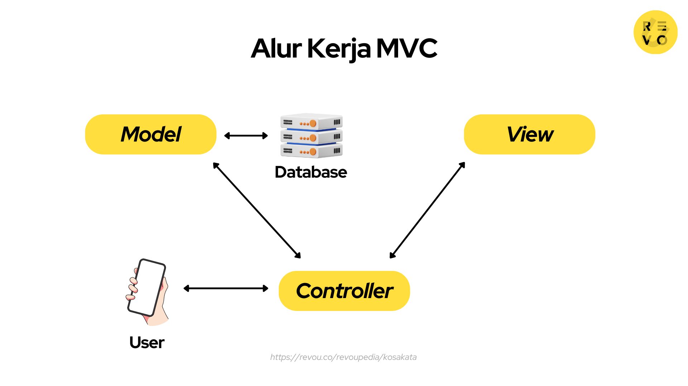

l# Laporan Modul 1: Perkenalan Laravel
**Mata Kuliah:** Workshop Web Lanjut   
**Nama:** Adha Gusti Harmadhan 
**NIM:** 2024573010009
**Kelas:** 2B

---
## Abstrak 
Tuliskan ringkasan singkat tentang isi laporan ini dan tujuan Anda membuat laporan.

Jawab :
Laporan ini membahas pengenalan awal framework **Laravel** sebagai salah satu framework PHP yang populer digunakan dalam pengembangan aplikasi web. Tujuan penyusunan laporan ini adalah untuk memahami konsep dasar Laravel serta fitur-fitur bawaan yang dimilikinya. Mempelajari materi di modul mempersiapkan diri untuk mengerjakan praktikum yang ada di modul tersebut.

---
## 1. Pendahuluan
- Tuliskan teori perkenalan tentang laravel

Jawab :
Laravel merupakan sebuah framework web berbasis **PHP** yang bersifat open-source dan dikembangkan untuk mempermudah pembuatan aplikasi modern. Framework ini pertama kali diperkenalkan oleh **Taylor Otwell** pada tahun 2011 dan sejak itu terus berkembang menjadi salah satu framework PHP dengan pengguna terbanyak.  

- Apa itu Laravel?

Jawab : 
Laravel adalah framework web PHP yang populer, bersifat open-source, dan dirancang untuk membangun aplikasi web modern yang skalabel dan aman.

- Karakteristik utama (MVC, opinionated, dsb.)

Jawab : 
1. Model-View-Controller (MVC): Memisahkan logika, tampilan, dan kontrol agar lebih terstruktur.
2. Opinionated: Menyediakan aturan dan standar bawaan untuk konsistensi.
3. Fitur Lengkap: ORM, Blade, routing, autentikasi, middleware, dll.

- Untuk jenis aplikasi apa Laravel cocok?

Jawab :
Aplikasi besar karena Mendukung skalabilitas dengan ORM, migration, queue, dan ekosistem paket yang lengkap.

---
## 2. Komponen Utama Laravel (ringkas)
Tuliskan penjelasan singkat (1–3 kalimat) untuk tiap komponen berikut:
- Blade (templating) :  Engine templating bawaan Laravel untuk membuat tampilan dinamis dengan sintaks sederhana dan dukungan komponen.  

- Eloquent (ORM) : 
Object Relational Mapping untuk berinteraksi dengan database menggunakan model tanpa harus menulis query SQL mentah.

- Routing :
Sistem pengaturan jalur URL yang menghubungkan permintaan pengguna dengan logika aplikasi.  

- Controllers : 
Tempat menuliskan logika aplikasi untuk menangani request dan mengembalikan response.  

- Migrations & Seeders :
Alat untuk membuat, memperbarui, dan mengatur struktur database, serta mengisi data awal atau data contoh.  

- Artisan CLI :
Command Line Interface untuk menjalankan perintah seperti membuat controller, model, migrasi, hingga menjalankan server lokal.  

- Testing (PHPUnit) :
Fitur pengujian otomatis untuk memastikan aplikasi bebas dari kesalahan. 

- Validation :
Laravel memiliki sistem validasi bawaan untuk memeriksa input dari form.

- Password Hashing :
Fitur hashing kata sandi bawaan menggunakan Bcrypt

---
## 3. Berikan penjelasan untuk setiap folder dan files yang ada didalam struktur sebuah project laravel.
Jawab :
1. Folder didalam struktur sebuah project laravel

- app/
Tempat kode utama aplikasi (Model, Controller, Middleware, dsb).

- bootstrap/
Menangani proses awal (bootstrap) aplikasi dan menyimpan cache konfigurasi.

- config/
Berisi file konfigurasi aplikasi (database, mail, cache, dll).

- database/
Menyimpan migrasi, seeder, dan factory untuk database.

- public/
Folder yang diakses pengguna. Berisi index.php (entry point), serta file publik (gambar, CSS, JS).

- resources/
Menyimpan view Blade, file bahasa, dan asset mentah (CSS/JS) sebelum diproses.

- routes/
Berisi definisi route (web.php, api.php, dll) untuk mengatur URL aplikasi.

- storage/
Menyimpan file hasil runtime: log, cache, session, serta file upload.

- tests/
Tempat menaruh unit test dan feature test.

- vendor/
Menyimpan semua dependensi PHP dari Composer.

2. Files didalam struktur sebuah project laravel

- .env
Menyimpan konfigurasi environment (database, app key, mail, dsb).

- .env.example
Template contoh .env agar bisa disalin saat setup proyek baru.

- artisan
Command line Laravel untuk menjalankan perintah (migrasi, generate file, dsb).

- composer.json
Daftar dependensi PHP dan metadata proyek.

- composer.lock
Menyimpan versi pasti dari dependensi yang digunakan.

- package.json
Daftar dependensi frontend (Node.js) untuk asset (misal Vite, Tailwind).

- phpunit.xml
File konfigurasi testing dengan PHPUnit.

- vite.config.js
Konfigurasi Vite untuk meng-compile asset frontend (CSS, JS, Vue/React).

---

## 4. Diagram MVC dan Cara kerjanya
Jawab :

Umumnya alur kerja MVC yaitu controller berinteraksi dengan user, lalu meneruskan perintah user ke model untuk menampilkan data yang diminta. Selanjutnya model akan memberikan data tersebut ke controller agar ditampilkan oleh view. 

Misalnya, Andin membuka aplikasi Netflix di ponselnya, memilih menu Category di homepage dan mengeklik opsi “Romance”. Sistem app kemudian mengirimkan permintaan (request) kepada server Netflix untuk menampilkan daftar film ber-genre romantis. Server akan meneruskan permintaan tersebut kepada controller. 

Setelah permintaan diterima, controller akan berinteraksi dengan model untuk mengambil data tentang film romantis di database. Setelah data terkumpul, model akan mengirimkan data tersebut kembali ke controller. 

Controller mengirim data daftar film romantis ke view dan memintanya untuk melakukan proses rendering, atau menggabungkan beberapa objek agar bisa ditampilkan. 

Setelah data selesai dirender, view mengirimkannya kembali ke controller agar bisa ditampilkan pada tampilan aplikasi Netflix yang digunakan Andin. 

---

## 6. Kelebihan & Kekurangan (refleksi singkat)
1. Kelebihan Laravel menurut Anda :
- Mudah dipelajari & didukung komunitas luas, cocok untuk pemula serta memiliki dokumentasi dan forum yang lengkap.
- Produktif & efisien, banyak fitur bawaan (autentikasi, routing, ORM) dan struktur kode rapi yang mempercepat pengembangan.
- Populer ,  digunakan secara global, mudah diadaptasi dalam berbagai proyek.

2. Hal yang mungkin menjadi tantangan bagi pemula :
- Sering ada update versi sehingga developer harus cepat menyesuaikan.
- Performa eksekusi kadang lebih lambat dibanding framework lain seperti CodeIgniter.
- Ukuran framework cukup besar, sehingga terasa lebih berat dibanding framework ringan.  

---

## 7. Referensi
Cantumkan sumber yang Anda baca (buku, artikel, dokumentasi) — minimal 2 sumber. Gunakan format sederhana (judul — URL). 

Jawab :
- Modul 1 - Introduction - https://hackmd.io/@mohdrzu/By0Wc1Dule
- Apa Itu Laravel Hingga Kelebihan dan Kekurangannya - https://www.gramedia.com/literasi/laravel/

---
