# Laporan Modul 2: Laravel Fundamentasl

**Mata Kuliah:** Workshop Web Lanjut  
**Nama:** Adha Gusti Harmadhan  
**NIM:** 2024573010009  
**Kelas:** 2B TI

---

## Abstrak

Tuliskan ringkasan singkat tentang isi laporan ini dan tujuan Anda membuat laporan.  
Jawab :  
Laporan ini berisi ringkasan dari kegiatan praktikum pada Modul 2: Laravel Fundamentals dalam mata kuliah Workshop Web Lanjut. Tujuan dari laporan ini adalah mencatat pemahaman dan latihan dasar penggunaan framework Laravel, seperti arsitektur Model-View-Controller (MVC), Routing, Controller, View, dan penggunaan Blade Templating Engine. Pada praktikum ini dilakukan dua percobaan, yaitu membuat halaman selamat datang dan membuat aplikasi kalkulator sederhana. Dari kegiatan ini, penulis jadi lebih paham bagaimana teori yang dipelajari bisa diterapkan langsung dalam pengembangan aplikasi web dengan Laravel.

---

## 1. Dasar Teori

- Apa itu MVC (Model, View, Controller).  
  Jawab :  
  MVC (Model–View–Controller) adalah pola yang digunakan untuk memisahkan bagian-bagian dalam aplikasi agar lebih teratur dan mudah dikelola. Model berfungsi untuk mengatur data dan logika, biasanya menggunakan Eloquent Model yang langsung berhubungan dengan database. View adalah bagian tampilan, yaitu apa yang dilihat pengguna di layar, dan dalam Laravel biasanya ditulis menggunakan Blade template. Controller sendiri berperan sebagai penghubung antara model dan view. Ia menerima input dari pengguna lewat route, kemudian mengolah data, dan akhirnya mengirim hasilnya kembali ke view. Dengan cara ini, Laravel menjadi lebih rapi dan mudah dikembangkan karena setiap bagian memiliki tugasnya masing-masing.

- Konsep Routing di Laravel.  
  Jawab :  
  Routing berfungsi untuk menentukan bagaimana aplikasi merespons request yang masuk. Route ditulis di routes/web.php untuk aplikasi web. Misalnya route / bisa diarahkan ke controller tertentu atau langsung mengembalikan view.

- Fungsi Middleware.  
  Jawab :  
  Middleware adalah lapisan yang digunakan untuk memfilter request sebelum masuk ke aplikasi, misalnya untuk autentikasi, logging, atau pengecekan kondisi tertentu.

- Bagaimana cara Laravel menangani Request dan Response.  
  Jawab :  
  Laravel menyediakan cara mudah untuk mengakses data dari request, seperti input form atau query string, dan juga memproses response dalam bentuk string, view, JSON, maupun file.

- Peran Controller dan View.  
  Jawab :  
  Controller bertugas menjalankan logika aplikasi dan menghubungkan data dari model ke tampilan. View bertugas menampilkan data kepada pengguna dalam bentuk HTML.

- Fungsi Blade Templating Engine.  
  Jawab :  
  Blade adalah template engine bawaan Laravel yang digunakan untuk mengelola tampilan dengan sintaks yang sederhana, seperti menampilkan variabel {{$name}} atau menggunakan struktur kontrol @if dan @foreach.

---

## 2. Langkah-Langkah Praktikum

Tuliskan langkah-langkah yang sudah dilakukan, sertakan potongan kode dan screenshot hasil.

2.1 Praktikum 1 – Route, Controller, dan Blade View

- Tambahkan route pada routes/web.php.
- Buat controller WelcomeController.
- Buat view mywelcome.blade.php.
- Jalankan aplikasi dan tunjukkan hasil di browser.

Screenshot Hasil:

- Tambahkan route pada routes/web.php.

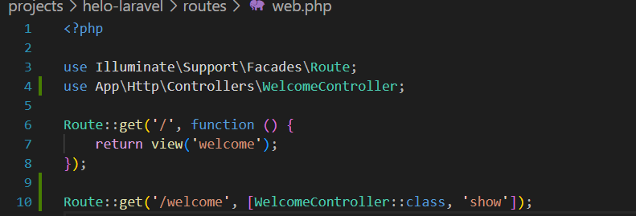

- Buat controller WelcomeController.

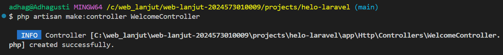

- Buat view mywelcome.blade.php.

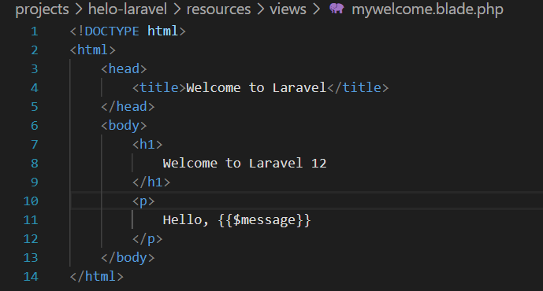

- Jalankan aplikasi dan tunjukkan hasil di browser.

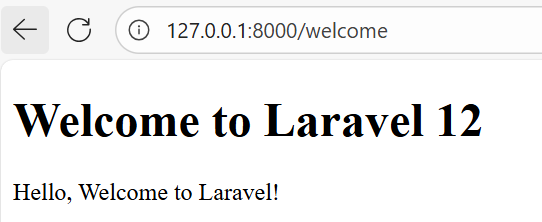

2.2 Praktikum 2 – Membuat Aplikasi Sederhana "Calculator"

- Tambahkan route untuk kalkulator.
- Buat controller CalculatorController.
- Tambahkan view calculator.blade.php.
- Jalankan aplikasi dan coba dengan beberapa input berbeda.

Screenshot Hasil:   

- Tambahkan route untuk kalkulator.

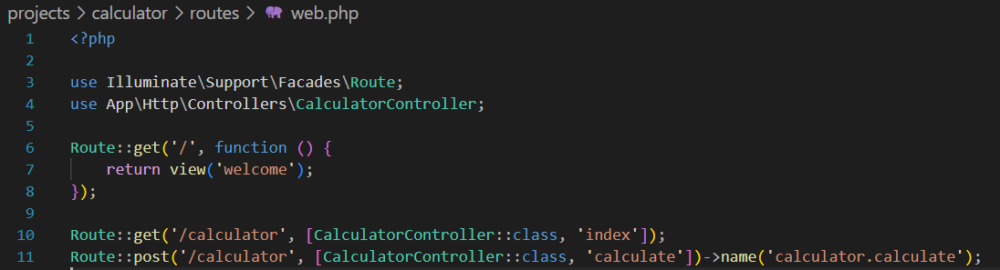

- Buat controller CalculatorController.

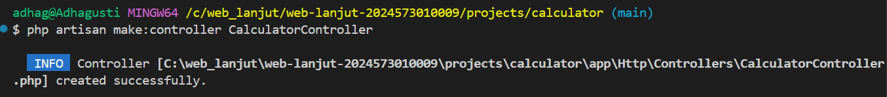

- Tambahkan view calculator.blade.php.

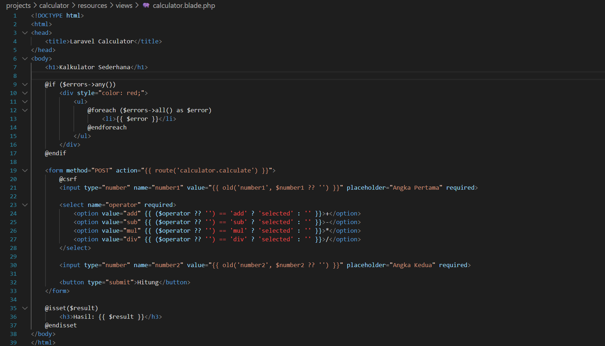

- Jalankan aplikasi dan coba dengan beberapa input berbeda.  
Penjumlahan :  

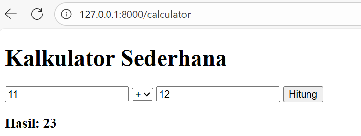  

Penngurangan :  

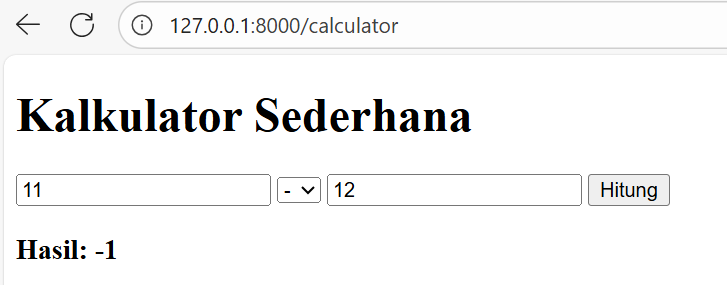  

Perkalian :  

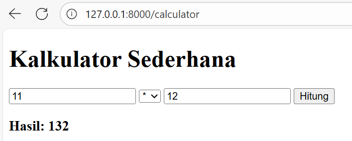  

Pembagian :  
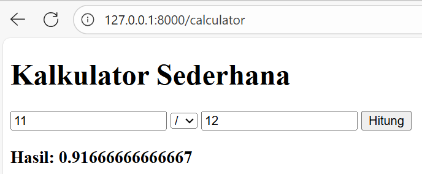  
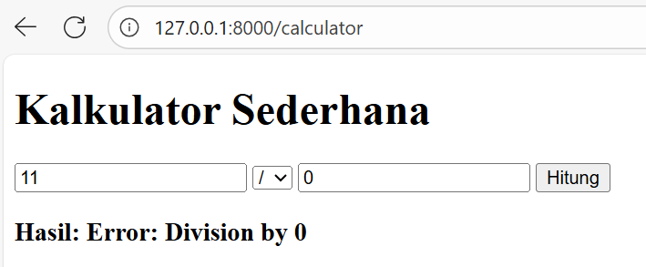  

---

## 3. Hasil dan Pembahasan

Jelaskan apa hasil dari praktikum yang dilakukan.

- Apakah aplikasi berjalan sesuai harapan?  
  Jawab :  
  Ya, aplikasi berjalan sesuai harapan. Halaman welcome tampil dengan benar, dan kalkulator bisa memproses perhitungan sesuai input yang dimasukkan pengguna.

- Apa yang terjadi jika ada input yang salah (misalnya pembagian dengan 0)?  
  Jawab :  
  Jika ada input yang salah, misalnya melakukan pembagian dengan 0, maka akan muncul error atau hasil yang tidak valid. Hal ini bisa diatasi dengan menambahkan validasi agar aplikasi tidak crash dan memberi pesan kesalahan ke pengguna.

- Bagaimana validasi input bekerja di Laravel?  
  Jawab :  
  Validasi input di Laravel bekerja dengan memeriksa data yang masuk sebelum diproses. Jika data tidak sesuai aturan (contohnya angka kosong, format salah, atau pembagian nol), Laravel akan menolak input tersebut dan mengembalikan pesan error agar pengguna memperbaikinya.

- Apa peran masing-masing komponen (Route, Controller, View) dalam program yang dibuat?  
  Jawab :  
  Route berfungsi menghubungkan URL dengan fungsi atau controller tertentu. Controller mengatur logika aplikasi, misalnya menghitung operasi matematika pada kalkulator. View bertugas menampilkan hasil ke pengguna dalam bentuk HTML, seperti tampilan form kalkulator dan hasil perhitungan.

---

## 4. Kesimpulan

Tulis kesimpulan dari praktikum ini

Melalui praktikum ini dapat dipahami dasar-dasar penggunaan framework Laravel, khususnya konsep MVC, routing, controller, view, dan Blade. Percobaan membuat halaman sederhana dan aplikasi kalkulator menunjukkan bahwa Laravel menyediakan struktur yang rapi serta memudahkan dalam mengelola logika, data, dan tampilan secara terpisah. Selain itu, praktikum ini juga memberikan gambaran nyata bagaimana setiap komponen saling bekerja sama sehingga aplikasi dapat berjalan sesuai harapan, mulai dari pengolahan input hingga menampilkan hasil ke pengguna.

---

## 5. Referensi

Cantumkan sumber yang Anda baca (buku, artikel, dokumentasi) — minimal 2 sumber. Gunakan format sederhana (judul — URL).

- Modul 2 - Laravel Fundamentals - https://hackmd.io/@mohdrzu/B1zwKEK5xe
- Petani Kode: Tutorial Laravel Dasar — https://www.petanikode.com/tutorial/laravel/

---
