# Laporan Modul 3: Laravel Controller

**Mata Kuliah:** Workshop Web Lanjut  
**Nama:** Adha Gusti Harmadhan  
**NIM:** 2024573010009  
**Kelas:** 2B TI

---

## Abstrak

Laporan ini berisi hasil praktikum dari **Modul 3: Laravel Controller** pada mata kuliah Workshop Web Lanjut. Tujuan laporan ini adalah untuk memahami fungsi dan peran controller dalam framework Laravel serta bagaimana controller mengelola logika aplikasi, menangani request, dan mengembalikan response ke view. Praktikum ini meliputi tiga percobaan utama: (1) menangani request dan response melalui controller, (2) menggunakan route grouping, dan (3) menerapkan prefix dan namespace dalam pengelompokan rute. Melalui praktikum ini, penulis belajar bagaimana cara membuat, mengelola, serta mengorganisasi controller agar aplikasi Laravel lebih terstruktur dan mudah dikembangkan.

---

## 1. Dasar Teori

- **Apa itu Controller di Laravel**  
  Controller adalah komponen pada arsitektur MVC (Model–View–Controller) yang berfungsi sebagai penghubung antara _Model_ dan _View_. Controller bertugas menangani request dari pengguna melalui route, memproses logika bisnis, berinteraksi dengan data dari model, lalu mengembalikan hasilnya ke view untuk ditampilkan.

- **Jenis-Jenis Controller di Laravel**

  1. **Basic Controller:** Controller standar yang dapat berisi beberapa metode untuk berbagai endpoint.
  2. **Resource Controller:** Controller yang mengikuti pola RESTful CRUD dengan metode bawaan seperti index, store, update, dan destroy.
  3. **Invokable Controller:** Controller dengan satu metode \_\_invoke() yang cocok untuk endpoint tunggal.

- **Konsep Routing dengan Controller**  
  Routing menghubungkan URL dengan metode dalam controller. Misalnya:

  ```php
  Route::get('/home', [PageController::class, 'home']);
  ```

  Artinya setiap kali pengguna mengakses /home, maka metode home() di PageController akan dijalankan.

- **Grouping Route dan Prefix**  
  Laravel memungkinkan pengelompokan rute untuk menjaga kerapian kode. Contohnya:

  ```php
  Route::controller(UserController::class)->group(function () {
      Route::get('/users', 'index');
      Route::get('/users/{id}', 'show');
  });
  ```

  Selain itu, prefix seperti admin/ dapat digunakan untuk mengelompokkan rute dengan struktur tertentu, misalnya untuk area dashboard admin.

- **Injeksi Request dan Validasi di Controller**  
  Laravel menyediakan _dependency injection_ sehingga objek `Request` dapat langsung digunakan dalam metode controller.

  ```php
  public function store(Request $request) {
      $request->validate([
          'name' => 'required',
          'email' => 'required|email'
      ]);
  }
  ```

- **Jenis Response dari Controller**  
  Controller dapat mengembalikan berbagai jenis response:
  - View: `return view('welcome');`
  - JSON: `return response()->json(['success' => true]);`
  - Redirect: `return redirect()->route('home');`

---

## 2. Langkah-Langkah Praktikum

### 2.1 Praktikum 1 – Menangani Request dan Response View

**Langkah-langkah:**

1. Buat proyek baru:

   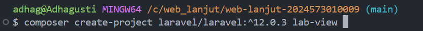

2. Buat controller:

   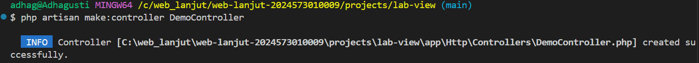

3. Tambahkan metode berikut ke `DemoController.php`:

   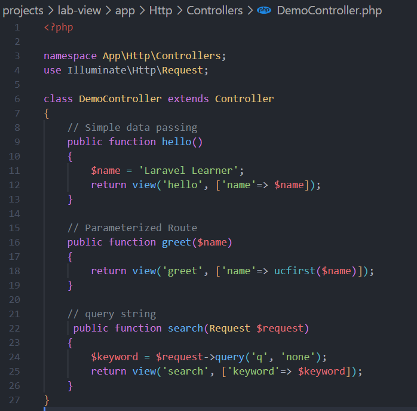

4. Tambahkan route pada `routes/web.php`:

   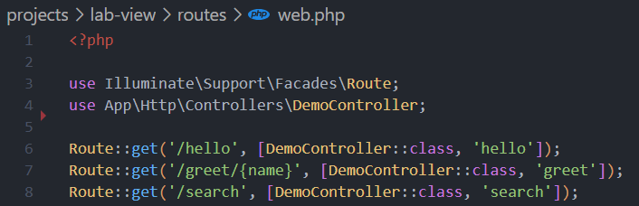

5. Buat tiga view di `resources/views/`:

   - **hello.blade.php**

   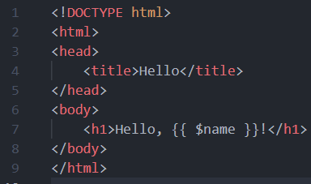

   - **greet.blade.php**

   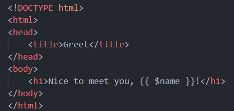

   - **search.blade.php**

   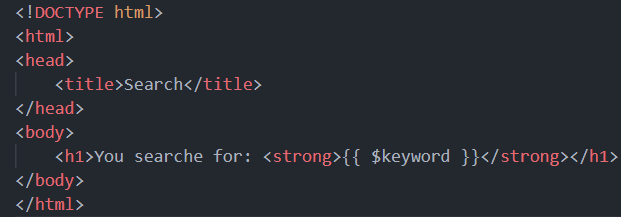

**Hasil Pengujian:**

- `http://127.0.0.1:8000/hello` → menampilkan **Hello, Laravel Learner!**

  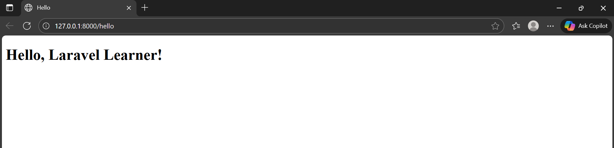

- `http://127.0.0.1:8000/greet/Adha` → menampilkan **Nice to meet you, Adha!**

  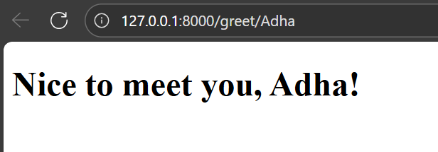

- `http://127.0.0.1:8000/search?q=laravel` → menampilkan **You searched for: laravel**

  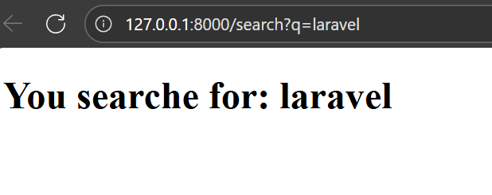

---

### 2.2 Praktikum 2 – Menggunakan Group Route

**Langkah-langkah:**

1. Buat proyek baru:

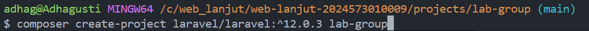

2. Buat controller:

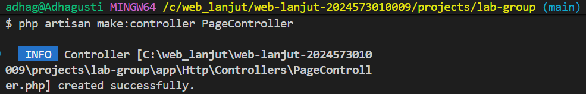

3. Tambahkan metode ke `PageController.php`:


4. Definisikan route:

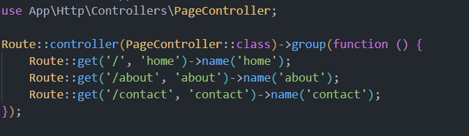

5. Buat folder `resources/views/pages/` dengan file:

   - **home.blade.php**

     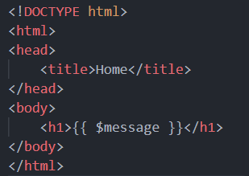

   - **about.blade.php**

     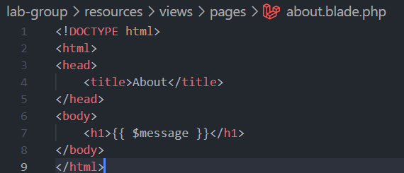

   - **contact.blade.php**

     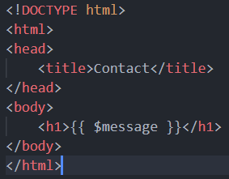

**Hasil Pengujian:**

- `http://127.0.0.1:8000/` → menampilkan **Welcome to the homepage.**

  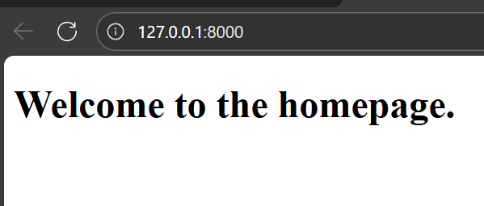

- `http://127.0.0.1:8000/about` → menampilkan **This is the about page.**

  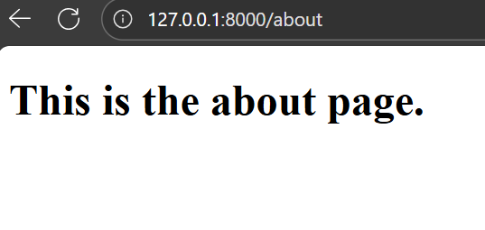

- `http://127.0.0.1:8000/contact c` → menampilkan **Reach us through the contact page.**

  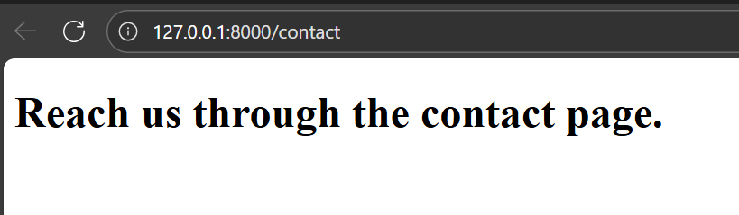

---

### 2.3 Praktikum 3 – Prefix dan Namespace Controller

**Langkah-langkah:**

1. Buat proyek:

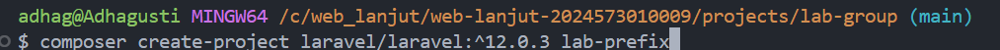

2. Buat controller dalam namespace Admin:

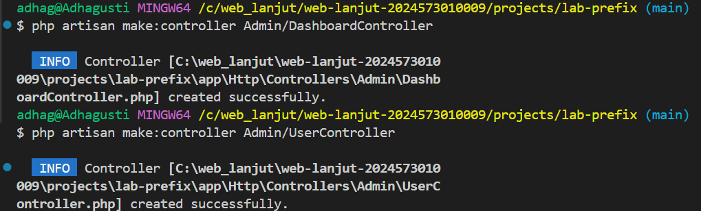

3. Tambahkan aksi pada controller:

   - **DashboardController.php**

     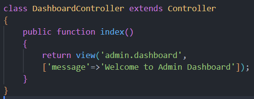

   - **UserController.php**

     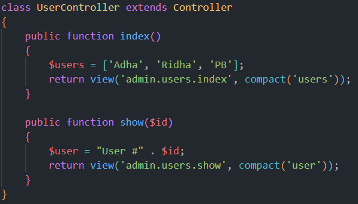

4. Tambahkan route:

   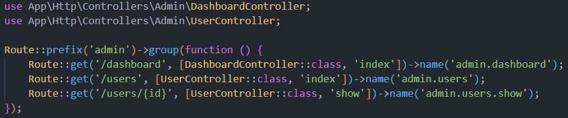

5. Buat view di `resources/views/admin/`:

   - **dashboard.blade.php**  
     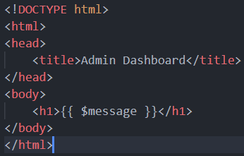

   - **users/index.blade.php**  
     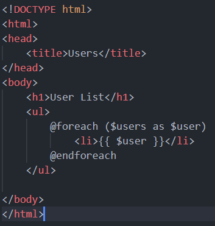

   - **users/show.blade.php**  
     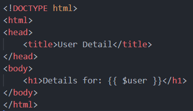

**Hasil Pengujian:**

- `http://127.0.0.1:8000/admin/dashboard` → menampilkan **Welcome to Admin Dashboard**
  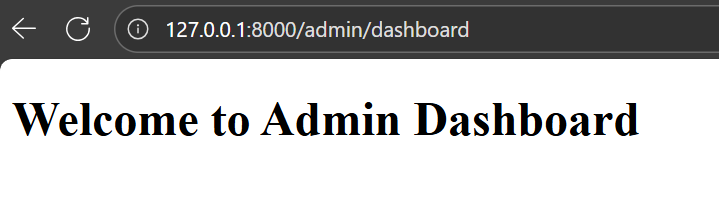

- `http://127.0.0.1:8000/admin/users` → menampilkan **User List.**  
   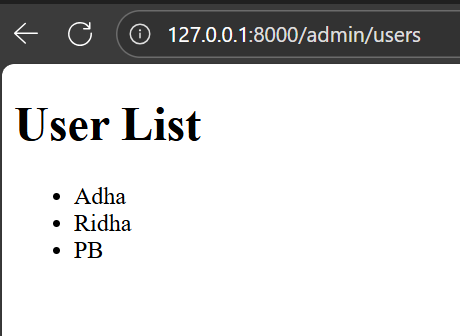

- `http://127.0.0.1:8000/admin/users/{id}` → menampilkan **Details for : user #adha**
  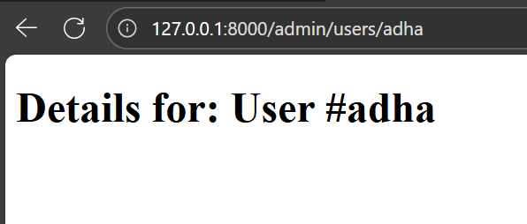

---

---

## 3. Hasil dan Pembahasan

Dari ketiga praktikum, dapat disimpulkan bahwa:

- Controller mampu memisahkan logika dari tampilan, sehingga kode lebih terorganisir.
- Laravel mendukung berbagai jenis controller untuk fleksibilitas pengembangan.
- Group route dan prefix membuat struktur rute lebih rapi dan efisien.
- Data dapat dikirim dari controller ke view menggunakan array atau fungsi `compact()`.
- Namespace membantu mengelompokkan controller dalam folder berbeda, misalnya untuk area admin.

Keseluruhan praktikum berjalan dengan baik tanpa error, dan hasil tampilan sesuai harapan di setiap URL yang diuji.

---

## 4. Kesimpulan

Dari praktikum ini dapat disimpulkan bahwa controller merupakan bagian penting dari Laravel yang berfungsi mengatur alur logika aplikasi. Melalui controller, data bisa diolah dan dikirim ke view dengan cara yang rapi.
Praktikum juga menunjukkan pentingnya penggunaan grouping route dan prefix untuk menjaga struktur aplikasi agar tetap mudah dibaca dan dikembangkan ke depannya.

---

## 5. Referensi

- Modul 3 - Laravel Controller — https://hackmd.io/@mohdrzu/B1zwKEK5xe
- Dokumentasi Resmi Laravel 12 — https://laravel.com/docs/12.x/controllers
