# **Laporan Modul 4: Laravel Blade Template Engine**

**Mata Kuliah:** Workshop Web Lanjut  
**Nama:** Adha Gusti Harmadhan  
**NIM:** 2024573010009  
**Kelas:** 2B TI  

---

## **Abstrak**

Laporan ini membahas hasil praktikum dari **Modul 4: Laravel Blade Template Engine** pada mata kuliah *Workshop Web Lanjut*. Tujuan dari modul ini adalah agar mahasiswa memahami cara kerja Blade sebagai template engine Laravel yang digunakan untuk mengatur tampilan agar lebih efisien, dinamis, dan mudah dikelola.  
Melalui serangkaian praktikum, mahasiswa mempelajari bagaimana meneruskan data ke view, menggunakan struktur kontrol Blade, membuat layout dengan pewarisan tampilan, hingga menerapkan konsep *partial views*, *Blade components*, dan *theme switching* menggunakan Bootstrap.  

---

## **1. Dasar Teori**

- **Pengertian Blade**  
  Blade adalah *template engine* bawaan Laravel yang digunakan untuk membuat tampilan secara dinamis dengan sintaks sederhana. Blade memungkinkan penggunaan ekspresi PHP, struktur kontrol, layout, dan komponen dalam format yang bersih.

- **Struktur Dasar Blade**  
  Blade menggunakan ekstensi `.blade.php`. Data dikirim dari controller ke view melalui fungsi `view()` dan ditampilkan di view menggunakan ekspresi `{{ $variable }}`.

- **Struktur Kontrol Blade**  
  Blade menyediakan direktif seperti `@if`, `@foreach`, `@forelse`, `@isset`, dan `@switch` yang digunakan untuk mengatur kondisi dan perulangan di dalam view.

- **Layout dan Section**  
  Untuk menghindari pengulangan kode, Blade menggunakan konsep layout dan section.

- **Partial dan Components**  
  - *Partial view*: digunakan untuk menyertakan potongan HTML seperti header, navbar, atau footer dengan `@include()`.
  - *Blade component*: digunakan untuk membuat UI yang dapat digunakan ulang seperti `<x-alert>` atau `<x-footer>`.

---

## **2. Langkah-Langkah Praktikum**

### **2.1 Praktikum 1 — Meneruskan Data dari Controller ke Blade View**

**Langkah-langkah:**

1. Buat proyek baru  
   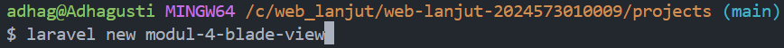

2. Buat controller  
   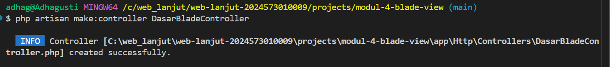

3. Tambahkan route di `routes/web.php`  
   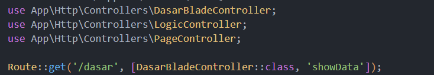

4. Isi controller dengan data  
   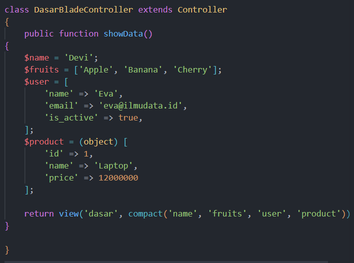

5. Buat file `resources/views/dasar.blade.php` untuk menampilkan data  
   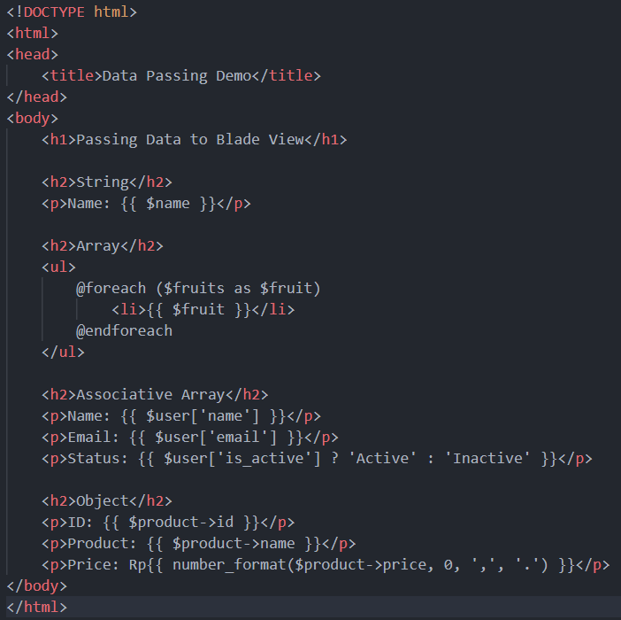

**Hasil Pengujian:**
- `http://127.0.0.1:8000/dasar` → menampilkan **data string, array, associative array, dan object**  
  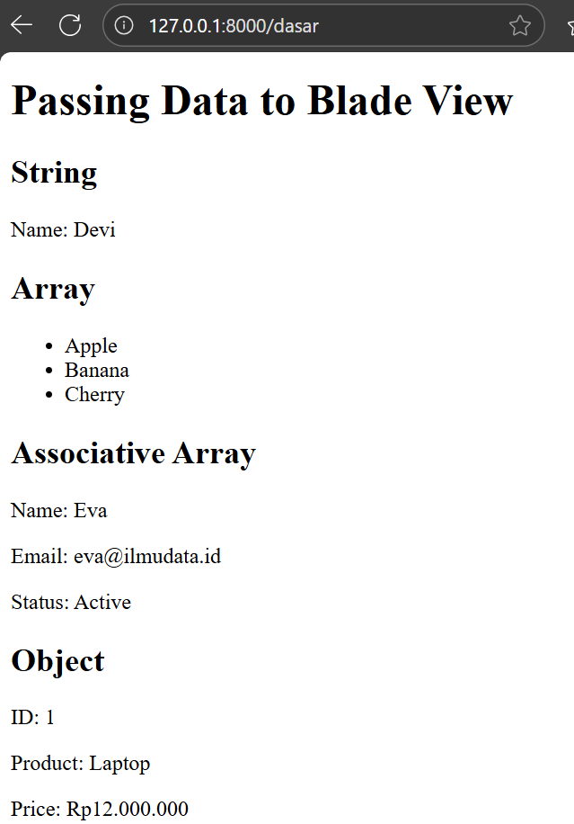

---

### **2.2 Praktikum 2 — Menggunakan Struktur Kontrol Blade**

**Langkah-langkah:**

1. Buat controller baru  
   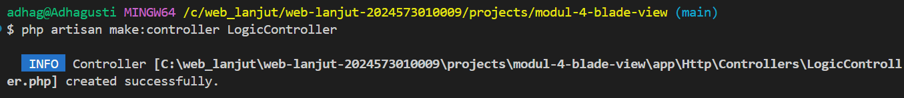

2. Tambahkan route di `routes/web.php`  
   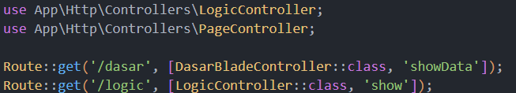

3. Isi controller dengan data logika dan array  
   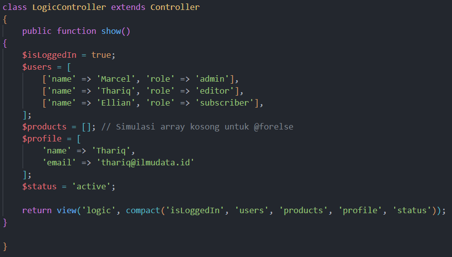

4. Buat file `resources/views/logic.blade.php` untuk menampilkan hasil kondisi Blade  
   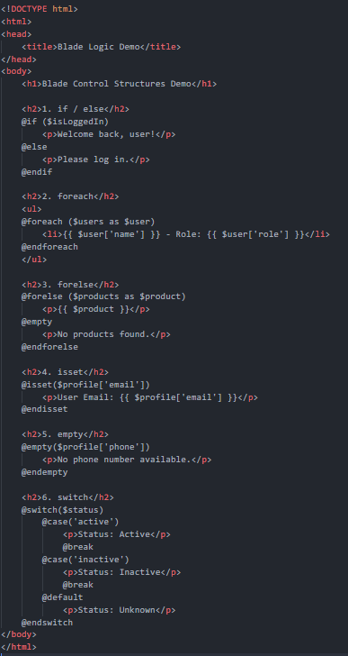

**Hasil Pengujian:**
- `http://127.0.0.1:8000/logic` → menampilkan:  
  - Pesan sambutan: **Welcome back, user!**  
  - Daftar user dengan role masing-masing  
  - Pesan *No products found* untuk array kosong  
  - Email pengguna dari `$profile`  
  - Pesan *No phone number available* jika tidak ada data  
  - Status pengguna: **Active**
  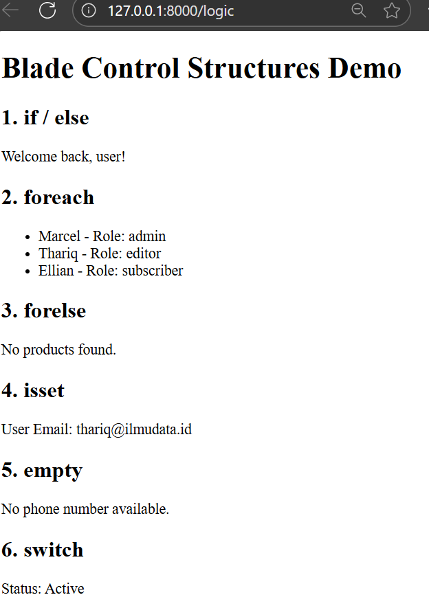

---

### **2.3 Praktikum 3 — Layout dan Personalisasi (Blade + Bootstrap)**

**Langkah-langkah:**

1. Buat controller baru  
   

2. Tambahkan route `/admin` dan `/user`  
   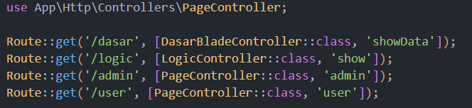

3. Tambahkan data role dan username di controller  
   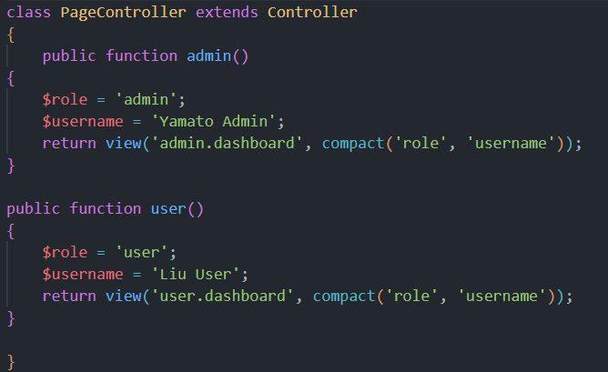

4. Buat layout utama `layouts/app.blade.php`  
   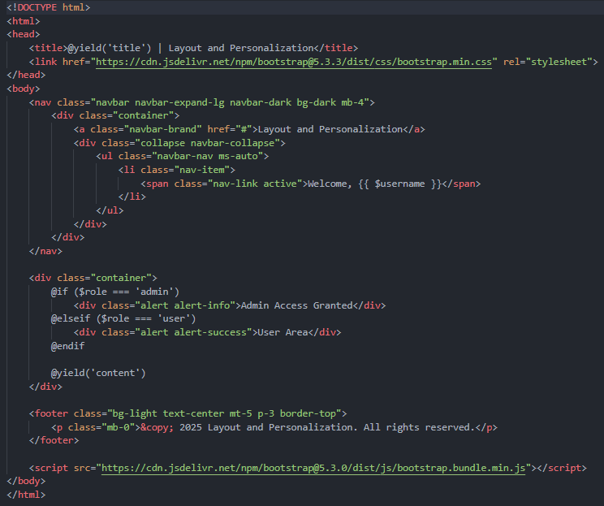

5. Buat view `admin/dashboard.blade.php` dan `user/dashboard.blade.php`  
   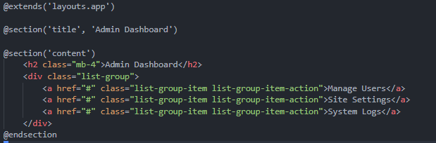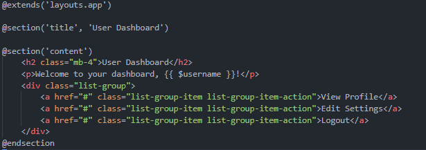

**Hasil Pengujian:**
- `http://127.0.0.1:8000/admin` → menampilkan **halaman admin** dengan pesan *Admin Access Granted*  
  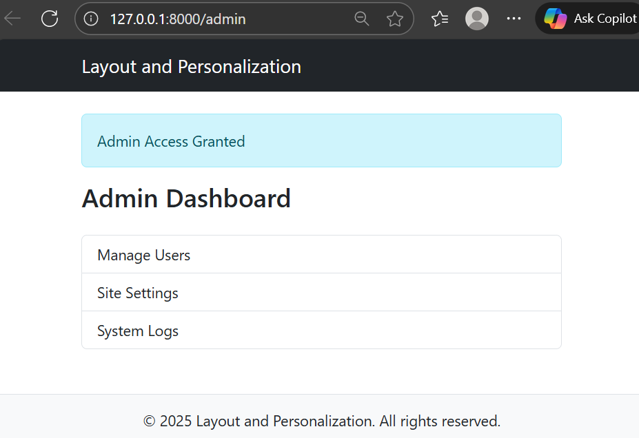
- `http://127.0.0.1:8000/user` → menampilkan **halaman user** dengan pesan *User Area*  
  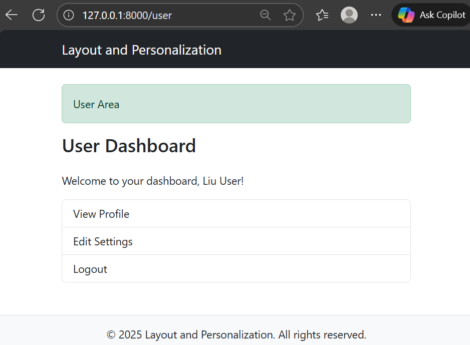

---

### **2.4 Praktikum 4 — Partial Views, Blade Components, dan Theme Switching**

**Langkah-langkah:**

1. Buat controller baru `UIController`  
   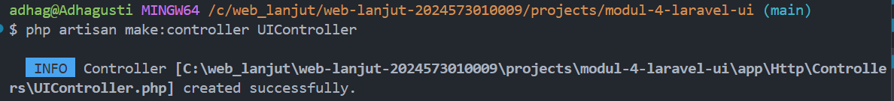

2. Tambahkan route ke halaman utama, about, contact, profile, serta /switch-theme/{theme}  
   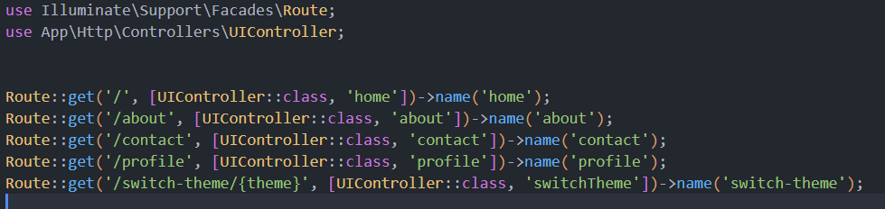

3. isi controllernya 
`app/Http/Controllers/UIController.php`:
      ```php
      <?php

      namespace App\Http\Controllers;

      use Illuminate\Http\Request;

      class UIController extends Controller
      {
         public function home(Request $request)
         {
            $theme = session('theme', 'light');
            $alertMessage = 'Selamat datang di Laravel UI Integrated Demo!';
            $features = ['Partial Views','Blade Components','Theme Switching','Bootstrap 5','Responsive Design'];
            return view('home', compact('theme','alertMessage','features'));
         }

         public function about(Request $request)
         {
            $theme = session('theme', 'light');
            $alertMessage = 'Halaman ini menggunakan Partial Views!';
            $team = [
                  ['name' => 'Ahmad', 'role' => 'Developer'],
                  ['name' => 'Sari', 'role' => 'Designer'],
                  ['name' => 'Budi', 'role' => 'Project Manager']
            ];
            return view('about', compact('theme','alertMessage','team'));
         }

         public function contact(Request $request)
         {
            $theme = session('theme', 'light');
            $departments = ['Technical Support','Sales','Billing','General Inquiry'];
            return view('contact', compact('theme','departments'));
         }

         public function profile(Request $request)
         {
            $theme = session('theme', 'light');
            $user = [
                  'name' => 'John Doe',
                  'email' => 'john.doe@example.com',
                  'join_date' => '2024-01-15',
                  'preferences' => ['Email Notifications','Dark Mode','Newsletter']
            ];
            return view('profile', compact('theme','user'));
         }

         public function switchTheme($theme, Request $request)
         {
            if (in_array($theme, ['light','dark'])) {
                  session(['theme' => $theme]);
            }
            return back();
         }
      }
      ```


4. Buat Layout Utama (Theme Support). 
Buat `resources/views/layouts/app.blade.php`:
      ```blade
      <!DOCTYPE html>
      <html lang="id" data-bs-theme="{{ $theme }}">
      <head>
      <meta charset="UTF-8" />
      <meta name="viewport" content="width=device-width, initial-scale=1.0" />
      <title>@yield('title','Laravel UI Integrated Demo')</title>
      <link href="https://cdn.jsdelivr.net/npm/bootstrap@5.3.3/dist/css/bootstrap.min.css" rel="stylesheet" />
      <style>
         body { padding-top:4rem; transition:.3s; min-height:100vh; }
         .theme-demo { border-radius:10px; padding:20px; margin:10px 0; transition:.3s; }
         .feature-card { transition:transform .2s; }
         .feature-card:hover { transform:translateY(-5px); }
      </style>
      </head>
      <body class="{{ $theme === 'dark' ? 'bg-dark text-light' : 'bg-light text-dark' }}">
      @include('partials.navigation')

      <div class="container mt-4">
         @if(isset($alertMessage) && !empty($alertMessage))
            @include('partials.alert', ['message' => $alertMessage, 'type' => 'info'])
         @endif

         @yield('content')
      </div>

      <x-footer :theme="$theme" />

      <script src="https://cdn.jsdelivr.net/npm/bootstrap@5.3.3/dist/js/bootstrap.bundle.min.js"></script>
      <script>
         document.addEventListener('DOMContentLoaded', function() {
            const themeLinks = document.querySelectorAll('a[href*="switch-theme"]');
            themeLinks.forEach(link => link.addEventListener('click', e => {
            e.preventDefault(); window.location.href = link.href;
            }));
         });
      </script>
      </body>
      </html>
      ```


5. Buat Partial Views**
      `resources/views/partials/navigation.blade.php`:
      ```blade
      <nav class="navbar navbar-expand-lg {{ $theme === 'dark' ? 'navbar-dark bg-dark' : 'navbar-light bg-light' }} fixed-top shadow">
      <div class="container">
         <a class="navbar-brand fw-bold" href="{{ route('home') }}">Laravel UI Demo</a>

         <button class="navbar-toggler" type="button" data-bs-toggle="collapse" data-bs-target="#navbarNav">
            <span class="navbar-toggler-icon"></span>
         </button>

         <div class="collapse navbar-collapse" id="navbarNav">
            <ul class="navbar-nav me-auto">
            <li class="nav-item"><a class="nav-link {{ request()->routeIs('home') ? 'active' : '' }}" href="{{ route('home') }}">Home</a></li>
            <li class="nav-item"><a class="nav-link {{ request()->routeIs('about') ? 'active' : '' }}" href="{{ route('about') }}">About</a></li>
            <li class="nav-item"><a class="nav-link {{ request()->routeIs('contact') ? 'active' : '' }}" href="{{ route('contact') }}">Contact</a></li>
            <li class="nav-item"><a class="nav-link {{ request()->routeIs('profile') ? 'active' : '' }}" href="{{ route('profile') }}">Profile</a></li>
            </ul>

            <ul class="navbar-nav">
            <li class="nav-item dropdown">
               <a class="nav-link dropdown-toggle" href="#" role="button" data-bs-toggle="dropdown">
                  Theme: {{ ucfirst($theme) }}
               </a>
               <ul class="dropdown-menu dropdown-menu-end">
                  <li><a class="dropdown-item" href="{{ route('switch-theme','light') }}">Light Mode</a></li>
                  <li><a class="dropdown-item" href="{{ route('switch-theme','dark') }}">Dark Mode</a></li>
               </ul>
            </li>
            </ul>
         </div>
      </div>
      </nav>
      ```

      `resources/views/partials/alert.blade.php`:
      ```blade
      @if(!empty($message))
      <div class="alert alert-{{ $type ?? 'info' }} alert-dismissible fade show" role="alert">
      {{ $message }}
      <button type="button" class="btn-close" data-bs-dismiss="alert"></button>
      </div>
      @endif
      ```


6. Buat Blade Components
Buat komponen:
      ```bash
      php artisan make:component Footer
      php artisan make:component FeatureCard
      php artisan make:component TeamMember
      php artisan make:component ContactForm
      ```

      `resources/views/components/footer.blade.php`:
      ```blade
      <footer class="mt-5 py-4 border-top {{ $theme === 'dark' ? 'border-secondary' : '' }}">
      <div class="container">
         <div class="row">
            <div class="col-md-6">
            <h5>Laravel UI Integrated Demo</h5>
            <p class="mb-0">Demonstrasi Partial Views, Blade Components, dan Theme Switching</p>
            </div>
            <div class="col-md-6 text-md-end">
            <p class="mb-0"><strong>Current Theme:</strong>
               <span class="badge {{ $theme === 'dark' ? 'bg-primary' : 'bg-dark' }}">{{ ucfirst($theme) }}</span>
            </p>
            <p class="mb-0">&copy; 2024 Laravel UI Demo. All rights reserved.</p>
            </div>
         </div>
      </div>
      </footer>
      ```

      `resources/views/components/feature-card.blade.php`:
      ```blade
      <div class="card feature-card h-100 {{ $theme === 'dark' ? 'bg-secondary text-white' : '' }}">
      <div class="card-body">
         <div class="d-flex align-items-center mb-3">
            <span class="fs-2 me-3">{{ $icon ?? '⭐' }}</span>
            <h5 class="card-title mb-0">{{ $title }}</h5>
         </div>
         <p class="card-text">{{ $description }}</p>
         @if(isset($badge))
            <span class="badge {{ $theme === 'dark' ? 'bg-light text-dark' : 'bg-dark' }}">{{ $badge }}</span>
         @endif
      </div>
      </div>
      ```

      `resources/views/components/team-member.blade.php`:
      ```blade
      <div class="col-md-4 mb-4">
      <div class="card {{ $theme === 'dark' ? 'bg-dark border-light' : '' }} h-100">
         <div class="card-body text-center">
            <div class="mb-3"><span class="fs-1">{{ $avatar ?? '👤' }}</span></div>
            <h5 class="card-title">{{ $name }}</h5>
            <p class="card-text text-muted">{{ $role }}</p>
            <p class="card-text">{{ $description }}</p>
         </div>
      </div>
      </div>
      ```

      `resources/views/components/contact-form.blade.php`:
      ```blade
      <div class="card {{ $theme === 'dark' ? 'bg-dark border-light' : '' }} h-100">
      <div class="card-header"><h5>Form Kontak</h5></div>
      <div class="card-body">
         <form>
            <div class="mb-3">
            <label class="form-label">Nama Lengkap</label>
            <input type="text" class="form-control {{ $theme === 'dark' ? 'bg-dark text-light border-light' : '' }}" placeholder="Masukkan nama Anda">
            </div>
            <div class="mb-3">
            <label class="form-label">Email</label>
            <input type="email" class="form-control {{ $theme === 'dark' ? 'bg-dark text-light border-light' : '' }}" placeholder="nama@example.com">
            </div>
            <div class="mb-3">
            <label class="form-label">Department</label>
            <select class="form-select {{ $theme === 'dark' ? 'bg-dark text-light border-light' : '' }}">
               <option selected>Pilih department...</option>
               @foreach($departments as $dept)
                  <option value="{{ $dept }}">{{ $dept }}</option>
               @endforeach
            </select>
            </div>
            <div class="mb-3">
            <label class="form-label">Pesan</label>
            <textarea class="form-control {{ $theme === 'dark' ? 'bg-dark text-light border-light' : '' }}" rows="4" placeholder="Tulis pesan Anda..."></textarea>
            </div>
            <button type="submit" class="btn btn-primary">Kirim Pesan</button>
         </form>
      </div>
      </div>
      ```

7. Buat Main Views
      `resources/views/home.blade.php`:
      ```blade
      @extends('layouts.app')
      @section('title','Home - Integrated Demo')

      @section('content')
      <div class="row">
      <div class="col-12">
         <div class="theme-demo {{ $theme === 'dark' ? 'bg-dark border-light' : 'bg-white border' }} mb-5">
            <h1 class="display-4 mb-4">🚀 Laravel UI Integrated Demo</h1>
            <p class="lead">Demonstrasi lengkap Partial Views, Blade Components, dan Theme Switching.</p>
            <div class="row mt-5">
            <div class="col-md-4 mb-4">
               <x-feature-card title="Partial Views" icon="📁" description="Gunakan @include untuk komponen sederhana." badge="Latihan 13" />
            </div>
            <div class="col-md-4 mb-4">
               <x-feature-card title="Blade Components" icon="🧩" description="Komponen dengan props & slots." badge="Latihan 14" />
            </div>
            <div class="col-md-4 mb-4">
               <x-feature-card title="Theme Switching" icon="🎨" description="Light/Dark mode via session." badge="Latihan 15" />
            </div>
            </div>
         </div>
      </div>
      </div>
      @endsection
      ```

      `resources/views/about.blade.php`:
      ```blade
      @extends('layouts.app')
      @section('title','About - Partial Views Demo')

      @section('content')
      <div class="row">
      <div class="col-12">
         <div class="theme-demo {{ $theme === 'dark' ? 'bg-dark border-light' : 'bg-white border' }} mb-4">
            <h1 class="mb-4">About - Partial Views</h1>
            <p class="lead">Menggunakan <code>@include</code> untuk potongan UI berulang.</p>
         </div>

         <h3 class="mb-4">Tim Kami</h3>
         <div class="row">
            @foreach($team as $member)
            <x-team-member
               :name="$member['name']"
               :role="$member['role']"
               :theme="$theme"
               :avatar="['👨‍💻','👩‍🎨','👨‍💼'][$loop->index]"
               :description="'Bergabung sejak 2024 dan aktif berkontribusi.'"
            />
            @endforeach
         </div>

         @include('partials.team-stats', ['theme' => $theme])
      </div>
      </div>
      @endsection
      ```

      `resources/views/partials/team-stats.blade.php`:
      ```blade
      <div class="card {{ $theme === 'dark' ? 'bg-dark border-light' : '' }} mt-4">
      <div class="card-header"><h5>Statistik Tim</h5></div>
      <div class="card-body">
         <div class="row text-center">
            <div class="col-md-3"><h3>3</h3><p class="text-muted">Anggota</p></div>
            <div class="col-md-3"><h3>12+</h3><p class="text-muted">Proyek</p></div>
            <div class="col-md-3"><h3>95%</h3><p class="text-muted">Kepuasan</p></div>
            <div class="col-md-3"><h3>2+</h3><p class="text-muted">Tahun</p></div>
         </div>
      </div>
      </div>
      ```

      `resources/views/contact.blade.php`:
      ```blade
      @extends('layouts.app')
      @section('title','Contact - Components Demo')

      @section('content')
      <div class="row">
      <div class="col-12">
         <div class="theme-demo {{ $theme === 'dark' ? 'bg-dark border-light' : 'bg-white border' }} mb-4">
            <h1 class="mb-4">Contact - Blade Components</h1>
            <p class="lead">Form kontak sebagai komponen Blade (props & pengisian dinamis).</p>
         </div>

         <div class="row">
            <div class="col-md-6">
            <x-contact-form :theme="$theme" :departments="$departments" />
            </div>
            <div class="col-md-6">
            <div class="card {{ $theme === 'dark' ? 'bg-dark border-light' : '' }} h-100">
               <div class="card-header"><h5>Informasi Kontak</h5></div>
               <div class="card-body">
                  <p><strong>Email:</strong> info@laraveldemo.com</p>
                  <p><strong>Telepon:</strong> +62 21 1234 5678</p>
                  <p><strong>Alamat:</strong> Jakarta, Indonesia</p>
                  <h6 class="mt-4">Department Tersedia:</h6>
                  <ul>
                  @foreach($departments as $dept)
                     <li>{{ $dept }}</li>
                  @endforeach
                  </ul>
               </div>
            </div>
            </div>
         </div>

      </div>
      </div>
      @endsection
      ```

      `resources/views/profile.blade.php`:
      ```blade
      @extends('layouts.app')
      @section('title','Profile - Theme Demo')

      @section('content')
      <div class="row">
      <div class="col-12">
         <div class="theme-demo {{ $theme === 'dark' ? 'bg-dark border-light' : 'bg-white border' }} mb-4">
            <h1 class="mb-4">Profile - Theme Demo</h1>
            <p class="lead">Contoh *theme switching* dengan penyimpanan preferensi di session.</p>
         </div>

         <div class="row">
            <div class="col-md-4">
            <div class="card {{ $theme === 'dark' ? 'bg-dark border-light' : '' }} text-center">
               <div class="card-body">
                  <div class="mb-3"><span class="fs-1">👤</span></div>
                  <h4>{{ $user['name'] }}</h4>
                  <p class="text-muted">{{ $user['email'] }}</p>
                  <p class="text-muted">Bergabung: {{ date('d M Y', strtotime($user['join_date'])) }}</p>
               </div>
            </div>
            </div>

            <div class="col-md-8">
            <div class="card {{ $theme === 'dark' ? 'bg-dark border-light' : '' }}">
               <div class="card-header"><h5>Preferensi Pengguna</h5></div>
               <div class="card-body">
                  <h6>Theme Saat Ini:</h6>
                  <div class="alert alert-{{ $theme === 'dark' ? 'dark' : 'info' }} d-flex align-items-center">
                  <span class="me-2 fs-4">{{ $theme === 'dark' ? '🌙' : '☀️' }}</span>
                  <div>
                     <strong>Mode {{ ucfirst($theme) }}</strong> — 
                     @if($theme === 'dark') Nyaman di malam hari. @else Cerah untuk siang hari. @endif
                  </div>
                  </div>

                  <h6 class="mt-4">Preferensi Lainnya:</h6>
                  <div class="d-flex flex-wrap gap-2">
                  @foreach($user['preferences'] as $pref)
                     <span class="badge bg-secondary">{{ $pref }}</span>
                  @endforeach
                  </div>

                  <div class="mt-4">
                  <h6>Ubah Tema:</h6>
                  <div class="btn-group" role="group">
                     <a href="{{ route('switch-theme','light') }}" class="btn btn-{{ $theme === 'light' ? 'primary' : 'outline-primary' }}">Light Mode</a>
                     <a href="{{ route('switch-theme','dark') }}" class="btn btn-{{ $theme === 'dark' ? 'primary' : 'outline-primary' }}">Dark Mode</a>
                  </div>
                  </div>
               </div>
            </div>
            </div>

         </div>
      </div>
      </div>
      @endsection
      ```

**Hasil Pengujian:**
- `http://127.0.0.1:8000/` → menampilkan **halaman utama** dengan komponen *feature-card*  
  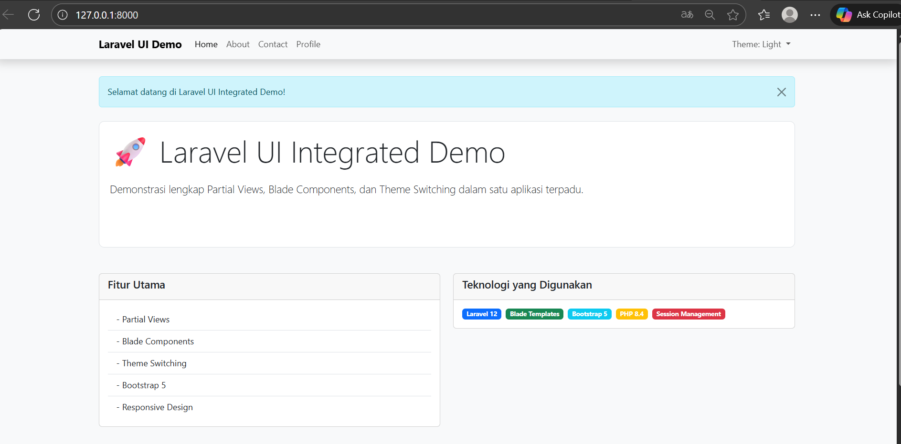
- `http://127.0.0.1:8000/about` → menampilkan **daftar anggota tim** dengan `<x-team-member>`  
  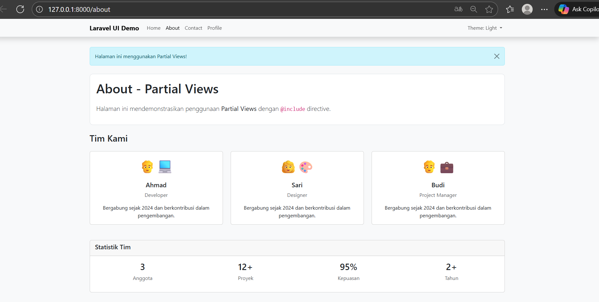
- `http://127.0.0.1:8000/contact` → menampilkan **form kontak dan daftar departemen**  
  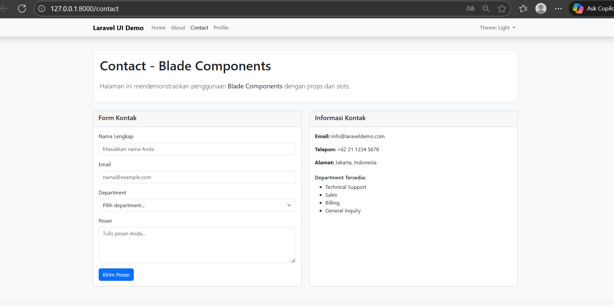
- `http://127.0.0.1:8000/profile` → menampilkan **profil pengguna** dan tombol ganti tema  
  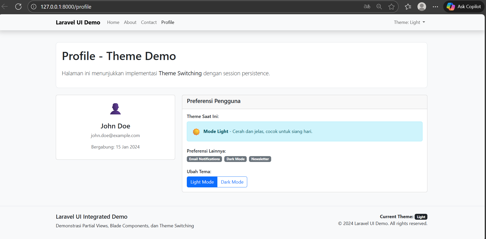
- `http://127.0.0.1:8000/switch-theme/dark` → tema berubah menjadi **gelap** dan tersimpan di session  
  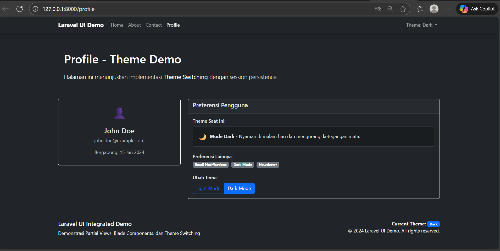

---

## **3. Hasil dan Pembahasan**

Dari keempat praktikum di atas, Blade terbukti mampu mempermudah pembuatan tampilan web Laravel. Kami belajar bagaimana data dikirim dari controller, bagaimana kondisi dan loop diatur, serta bagaimana layout dan komponen dapat digunakan ulang. Praktikum terakhir juga memperlihatkan bahwa Blade dapat bekerja dengan session untuk personalisasi tema.

---

## **4. Kesimpulan**

1. Blade merupakan fitur penting Laravel untuk membuat tampilan yang dinamis, efisien, dan mudah dikelola.  
2. Data dapat dikirim dari controller ke view dalam berbagai bentuk.  
3. Struktur kontrol Blade memisahkan logika tampilan dari logika bisnis.  
4. Layout dan section memungkinkan penggunaan ulang struktur halaman.  
5. Partial view dan Blade component mendukung pembuatan UI modular.  
6. Theme switching membuktikan integrasi Blade dengan session Laravel berjalan baik.

---

## **5. Referensi**

- Modul 4 - Laravel Blade Template Engine — https://hackmd.io/@mohdrzu/r1AIUzWpll
- Dokumentasi Resmi Laravel 12 — https://laravel.com/docs/12.x/controllers
