# **Laporan Modul 5: Form Submission & Data Validation**

**Mata Kuliah:** Workshop Web Lanjut  
**Nama:** Adha Gusti Harmadhan  
**NIM:** 2024573010009  
**Kelas:** 2B TI  

---

## **Abstrak**

Laporan ini membahas hasil praktikum dari **Modul 5: Form Submission & Data Validation** pada mata kuliah *Workshop Web Lanjut*. Tujuan modul ini adalah agar mahasiswa memahami alur pengiriman form pada Laravel (request → controller → response), mekanisme keamanan CSRF token, serta berbagai teknik validasi data — mulai dari validasi dasar, pesan error kustom, hingga implementasi multi-step form menggunakan session. Melalui praktikum mahasiswa belajar menampilkan form, memvalidasi input, menampilkan pesan error, serta menyimpan data sementara di session untuk form bertahap.

---

## **1. Dasar Teori**

- **Arsitektur Request–Response di Laravel**  
  Form di-submit dari *view*, diterima oleh *route* dan *controller*, kemudian controller melakukan validasi dan mengembalikan *response* (view/redirect). Data diterima sebagai instance `Request` dan dapat diakses dengan `$request->input('field')` atau divalidasi langsung dengan `$request->validate([...])`.

- **CSRF Protection**  
  Semua form method POST/PUT/PATCH/DELETE harus menyertakan `@csrf` di Blade. Direktif ini menghasilkan input `_token` yang dicek oleh middleware — tanpa token valid request akan diblokir (error 419).

- **Validasi Data**  
  Cara umum validasi di Laravel:
  1. `$request->validate([...])` di controller.  
  2. Form Request class (terpisah) untuk validasi kompleks.  
  3. `Validator` facade untuk skenario manual.  
  Rule umum: `required`, `email`, `integer`, `min`, `max`, `confirmed`, `unique`, `regex`, dsb.

- **Menampilkan Error & Old Input**  
  Laravel otomatis mengirim error ke view jika validasi gagal; gunakan `@error('field')` atau `$errors->all()` untuk menampilkannya. `old('field')` memulihkan input lama setelah redirect.

---

## **2. Langkah-Langkah Praktikum**

### **2.1 Praktikum 1 — Form Dasar dengan Validasi & Redirect**

**Langkah-langkah:**

1. Buat proyek baru  
   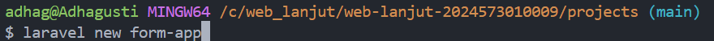

2. Tambahkan route di `routes/web.php`  
   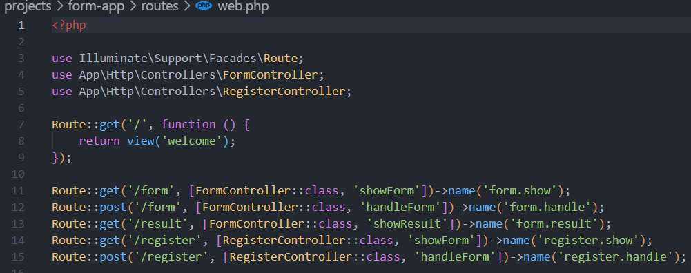


3. Buat controller `FormController`  
   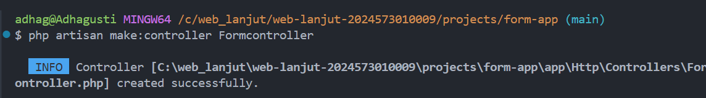


4. Edit File Form Controller:
   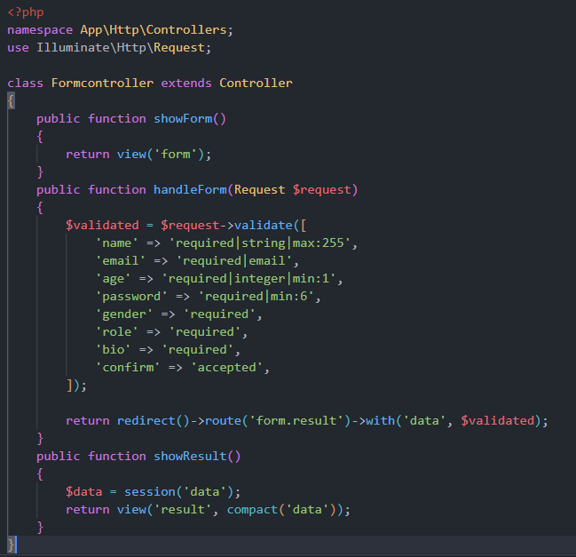

5. Buat view `form.blade.php` 
   ```blade
   <!DOCTYPE html>
    <html>
    <head>
        <title>Pengiriman Form</title>
        <link href="https://cdn.jsdelivr.net/npm/bootstrap@5.3.3/dist/css/bootstrap.min.css" rel="stylesheet">
    </head>
    <body class="container mt-5">
        <h2>Form Registrasi</h2>
        <form method="POST" action="{{ route('form.handle') }}">
            @csrf
            <div class="mb-3">
                <label>Nama</label>
                <input type="text" name="name" class="form-control" value="{{ old('name') }}">
                @error('name') <div class="text-danger">{{ $message }}</div> @enderror
            </div>
            <div class="mb-3">
                <label>Email</label>
                <input type="email" name="email" class="form-control" value="{{ old('email') }}">
                @error('email') <div class="text-danger">{{ $message }}</div> @enderror
            </div>
            <div class="mb-3">
                <label>Umur</label>
                <input type="number" name="age" class="form-control" value="{{ old('age') }}">
                @error('age') <div class="text-danger">{{ $message }}</div> @enderror
            </div>
            <div class="mb-3">
                <label>Password</label>
                <input type="password" name="password" class="form-control">
                @error('password') <div class="text-danger">{{ $message }}</div> @enderror
            </div>
            <div class="mb-3">
                <label>Jenis Kelamin</label><br>
                <div class="form-check form-check-inline">
                    <input class="form-check-input" type="radio" name="gender" value="male"> Laki-laki
                </div>
                <div class="form-check form-check-inline">
                    <input class="form-check-input" type="radio" name="gender" value="female"> Perempuan
                </div>
                @error('gender') <div class="text-danger">{{ $message }}</div> @enderror
            </div>
            <div class="mb-3">
                <label>Role</label>
                <select name="role" class="form-select">
                    <option value="">-- Pilih Role --</option>
                    <option value="user">User</option>
                    <option value="admin">Admin</option>
                </select>
                @error('role') <div class="text-danger">{{ $message }}</div> @enderror
            </div>
            <div class="mb-3">
                <label>Bio</label>
                <textarea name="bio" class="form-control">{{ old('bio') }}</textarea>
                @error('bio') <div class="text-danger">{{ $message }}</div> @enderror
            </div>
            <div class="form-check mb-3">
                <input type="checkbox" id="confirm" name="confirm" class="form-check-input">
                <label class="form-check-label" for="confirm">Saya konfirmasi informasi sudah benar</label>
                @error('confirm') <div class="text-danger">{{ $message }}</div> @enderror
            </div>
            <button type="submit" class="btn btn-primary" id="submitBtn" disabled>Submit</button>
        </form>

        <script>
            document.getElementById('confirm').addEventListener('change', function() {
                document.getElementById('submitBtn').disabled = !this.checked;
            });
        </script>
    </body>
    </html>
   ```
6. Buat view `result.blade.php`  
   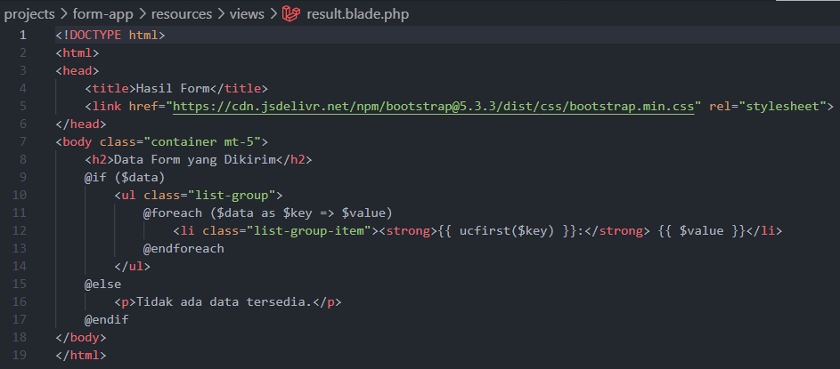

**Hasil Pengujian:**
- `http://127.0.0.1:8000/form` → menampilkan **Form Registrasi** (nama, email, umur, password, jenis kelamin, role, bio, checkbox konfirmasi).  
  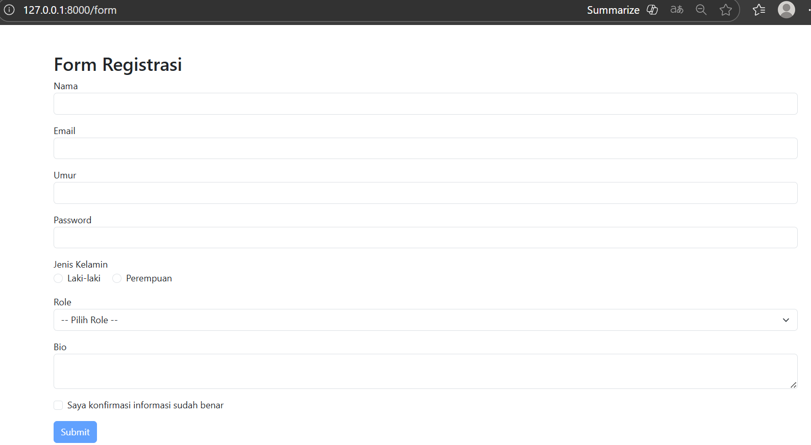
- Submit tanpa isi → kembali ke form dan tampilkan error per field (contoh: *The name field is required*).  
  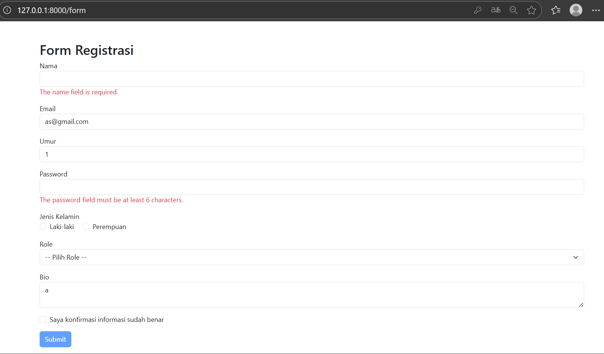
- Submit valid → redirect ke `http://127.0.0.1:8000/result` dan menampilkan data yang dikirim.  
  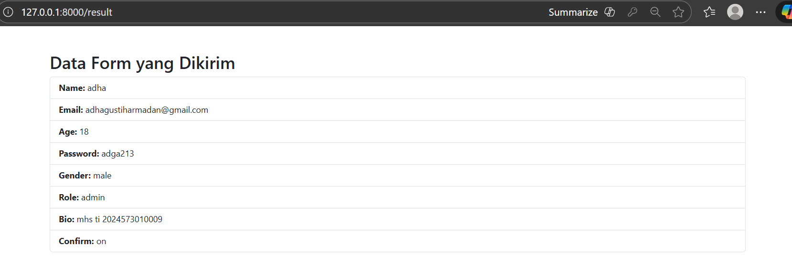

---

### **2.2 Praktikum 2 — Validasi Kustom & Pesan Error Sendiri**

**Langkah-langkah:**

1. Tambahkan route `/register` (GET & POST).  
   

2. Buat controller `RegisterController` :
  
   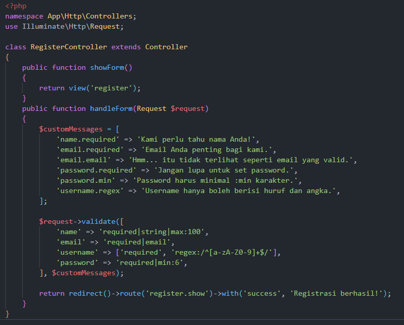

3. Buat view `register.blade.php` yang menampilkan pesan error kustom dan notifikasi sukses.  
   ```blade
   <!DOCTYPE html>
    <html>
    <head>
        <title>Form Register</title>
        <link href="https://cdn.jsdelivr.net/npm/bootstrap@5.3.3/dist/css/bootstrap.min.css" rel="stylesheet">
    </head>
    <body class="container mt-5">
        <h2>Contoh Validasi Kustom</h2>
        
        @if (session('success'))
            <div class="alert alert-success">
                {{ session('success') }}
            </div>
        @endif

        <form method="POST" action="{{ route('register.handle') }}">
            @csrf
            <div class="mb-3">
                <label for="name">Nama Lengkap</label>
                <input name="name" class="form-control" value="{{ old('name') }}">
                @error('name') <div class="text-danger">{{ $message }}</div> @enderror
            </div>
            <div class="mb-3">
                <label for="email">Alamat Email</label>
                <input name="email" class="form-control" value="{{ old('email') }}">
                @error('email') <div class="text-danger">{{ $message }}</div> @enderror
            </div>
            <div class="mb-3">
                <label for="username">Username</label>
                <input name="username" class="form-control" value="{{ old('username') }}">
                @error('username') <div class="text-danger">{{ $message }}</div> @enderror
            </div>
            <div class="mb-3">
                <label for="password">Password</label>
                @error('password') <div class="text-danger">{{ $message }}</div> @enderror
                <input type="password" name="password" class="form-control">
            </div>
            <button type="submit" class="btn btn-primary">Register</button>
        </form>
    </body>
    </html>
    ```

**Hasil Pengujian:**
- `http://127.0.0.1:8000/register` → menampilkan form register.  
  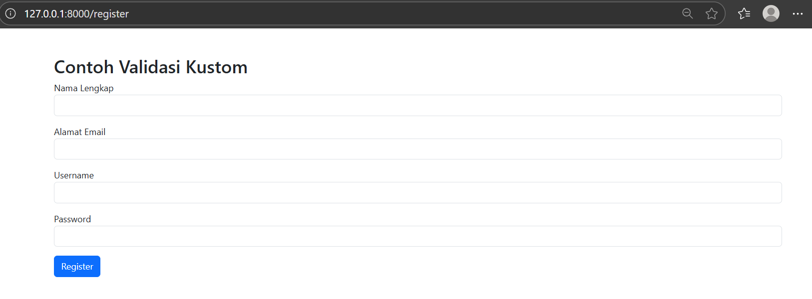
- Submit kosong → menampilkan pesan kustom (contoh: *Kami perlu tahu nama Anda!*).  
  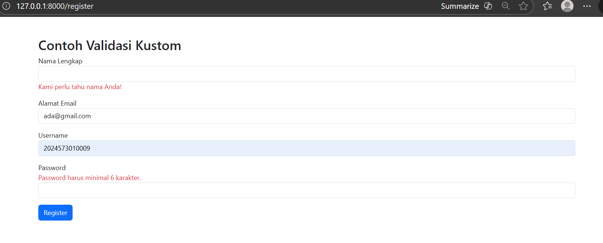
- Submit valid → muncul alert sukses: *Registrasi berhasil!*.  
  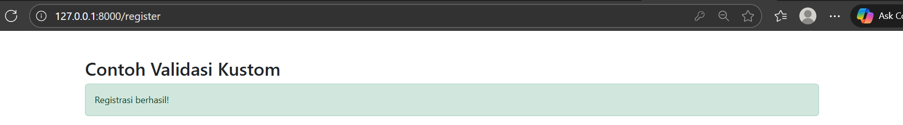

---

### **2.3 Praktikum 3 — Multi-Step Form dengan Session**

**Langkah-langkah:**

1.  Buat Project Laravel Baru  
   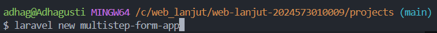

2.  Buat file layout di `resources/views/layouts/app.blade.php`:
   
   ```blade
   <!DOCTYPE html>
   <html lang="id">
   <head>
       <meta charset="UTF-8">
       <meta name="viewport" content="width=device-width, initial-scale=1.0">
       <title>@yield('title', 'Multi-Step Form')</title>
       <link href="https://cdn.jsdelivr.net/npm/bootstrap@5.3.3/dist/css/bootstrap.min.css" rel="stylesheet">
       <style>
           .step-progress {
               margin-bottom: 30px;
           }
           .step-item {
               text-align: center;
               position: relative;
           }
           .step-item .step-number {
               width: 40px;
               height: 40px;
               border-radius: 50%;
               background: #e9ecef;
               display: flex;
               align-items: center;
               justify-content: center;
               margin: 0 auto 10px;
               font-weight: bold;
           }
           .step-item.active .step-number {
               background: #007bff;
               color: white;
           }
           .step-item.completed .step-number {
               background: #28a745;
               color: white;
           }
           .card {
               box-shadow: 0 0.5rem 1rem rgba(0, 0, 0, 0.15);
           }
       </style>
   </head>
   <body>
       <nav class="navbar navbar-dark bg-dark">
           <div class="container">
               <span class="navbar-brand mb-0 h1">Multi-Step Form Demo</span>
           </div>
       </nav>
   
       <div class="container mt-4">
           @yield('content')
       </div>
   
       <script src="https://cdn.jsdelivr.net/npm/bootstrap@5.3.3/dist/js/bootstrap.bundle.min.js"></script>
   </body>
   </html>
   ```
   
3. Buat controller nya MultiStepFormController   
   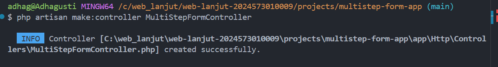
  
      Lalu isi
      ```php
      <?php

        namespace App\Http\Controllers;

        use Illuminate\Http\Request;

        class MultiStepFormController extends Controller
        {
            // Step 1 - Informasi Pribadi
            public function showStep1()
            {
                return view('multistep.step1', [
                    'step' => 1,
                    'progress' => 0
                ]);
            }

            public function storeStep1(Request $request)
            {
                $validated = $request->validate([
                    'full_name' => 'required|string|max:100',
                    'email' => 'required|email',
                    'phone' => 'required|string|max:15',
                    'address' => 'required|string|max:200',
                ]);

                // Simpan data ke session
                session(['step1_data' => $validated]);

                return redirect()->route('multistep.step2');
            }

            // Step 2 - Informasi Pendidikan
            public function showStep2()
            {
                if (!session('step1_data')) {
                    return redirect()->route('multistep.step1');
                }

                return view('multistep.step2', [
                    'step' => 2,
                    'progress' => 33
                ]);
            }

            public function storeStep2(Request $request)
            {
                $validated = $request->validate([
                    'education' => 'required|string|max:50',
                    'institution' => 'required|string|max:100',
                    'graduation_year' => 'required|integer|min:1900|max:' . date('Y'),
                    'major' => 'required|string|max:100',
                ]);

                session(['step2_data' => $validated]);

                return redirect()->route('multistep.step3');
            }

            // Step 3 - Pengalaman Kerja
            public function showStep3()
            {
                if (!session('step1_data') || !session('step2_data')) {
                    return redirect()->route('multistep.step1');
                }

                return view('multistep.step3', [
                    'step' => 3,
                    'progress' => 66
                ]);
            }

            public function storeStep3(Request $request)
            {
                $validated = $request->validate([
                    'current_job' => 'nullable|string|max:100',
                    'company' => 'nullable|string|max:100',
                    'experience_years' => 'required|integer|min:0|max:50',
                    'skills' => 'required|string|max:200',
                ]);

                session(['step3_data' => $validated]);

                return redirect()->route('multistep.summary');
            }

            // Summary - Ringkasan Data
            public function showSummary()
            {
                $step1Data = session('step1_data');
                $step2Data = session('step2_data');
                $step3Data = session('step3_data');

                if (!$step1Data || !$step2Data || !$step3Data) {
                    return redirect()->route('multistep.step1');
                }

                return view('multistep.summary', [
                    'step' => 4,
                    'progress' => 100,
                    'step1Data' => $step1Data,
                    'step2Data' => $step2Data,
                    'step3Data' => $step3Data
                ]);
            }

            // Complete - Proses Final
            public function complete(Request $request)
            {
                // Di sini Anda bisa menyimpan data ke database
                // Untuk demo, kita hanya akan menampilkan pesan sukses

                $allData = [
                    'personal' => session('step1_data'),
                    'education' => session('step2_data'),
                    'experience' => session('step3_data')
                ];

                // Hapus session data
                $request->session()->forget(['step1_data', 'step2_data', 'step3_data']);

                return view('multistep.complete', [
                    'data' => $allData
                ]);
            }
        }
        php```

4. Tambahkan route untuk step 1–3 + summary + complete
 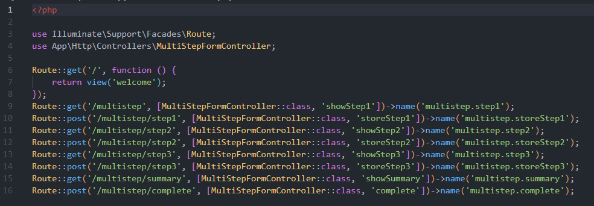

5. Buat view `multistep/step1.blade.php`, `step2.blade.php`, `step3.blade.php`, `summary.blade.php`, `complete.blade.php` dengan progress bar dan tombol navigasi.  
  
    Step 1 - Informasi Pribadi
    `resources/views/multistep/step1.blade.php`  
    ```php
    @extends('layouts.app')

    @section('title', 'Step 1 - Informasi Pribadi')

    @section('content')
    <div class="row justify-content-center">
        <div class="col-md-8">
            <!-- Progress Bar -->
            <div class="step-progress">
                <div class="row">
                    <div class="col-3 step-item active">
                        <div class="step-number">1</div>
                        <div>Informasi Pribadi</div>
                    </div>
                    <div class="col-3 step-item">
                        <div class="step-number">2</div>
                        <div>Pendidikan</div>
                    </div>
                    <div class="col-3 step-item">
                        <div class="step-number">3</div>
                        <div>Pengalaman</div>
                    </div>
                    <div class="col-3 step-item">
                        <div class="step-number">4</div>
                        <div>Ringkasan</div>
                    </div>
                </div>
            </div>

            <div class="card">
                <div class="card-header">
                    <h4 class="mb-0">Step 1: Informasi Pribadi</h4>
                </div>
                <div class="card-body">
                    <form method="POST" action="{{ route('multistep.storeStep1') }}">
                        @csrf
                        
                        <div class="row">
                            <div class="col-md-6 mb-3">
                                <label for="full_name" class="form-label">Nama Lengkap *</label>
                                <input type="text" class="form-control @error('full_name') is-invalid @enderror" 
                                      id="full_name" name="full_name" 
                                      value="{{ old('full_name', session('step1_data.full_name') ?? '') }}" 
                                      required>
                                @error('full_name')
                                    <div class="invalid-feedback">{{ $message }}</div>
                                @enderror
                            </div>
                            
                            <div class="col-md-6 mb-3">
                                <label for="email" class="form-label">Email *</label>
                                <input type="email" class="form-control @error('email') is-invalid @enderror" 
                                      id="email" name="email" 
                                      value="{{ old('email', session('step1_data.email') ?? '') }}" 
                                      required>
                                @error('email')
                                    <div class="invalid-feedback">{{ $message }}</div>
                                @enderror
                            </div>
                        </div>

                        <div class="row">
                            <div class="col-md-6 mb-3">
                                <label for="phone" class="form-label">Nomor Telepon *</label>
                                <input type="text" class="form-control @error('phone') is-invalid @enderror" 
                                      id="phone" name="phone" 
                                      value="{{ old('phone', session('step1_data.phone') ?? '') }}" 
                                      required>
                                @error('phone')
                                    <div class="invalid-feedback">{{ $message }}</div>
                                @enderror
                            </div>
                            
                            <div class="col-md-6 mb-3">
                                <label for="address" class="form-label">Alamat *</label>
                                <input type="text" class="form-control @error('address') is-invalid @enderror" 
                                      id="address" name="address" 
                                      value="{{ old('address', session('step1_data.address') ?? '') }}" 
                                      required>
                                @error('address')
                                    <div class="invalid-feedback">{{ $message }}</div>
                                @enderror
                            </div>
                        </div>

                        <div class="d-flex justify-content-between">
                            <div></div> <!-- Spacer -->
                            <button type="submit" class="btn btn-primary">
                                Lanjut ke Step 2 <i class="fas fa-arrow-right ms-2"></i>
                            </button>
                        </div>
                    </form>
                </div>
            </div>
        </div>
    </div>
    @endsection

    ```

    Step 2 - Informasi Pendidikan
    `resources/views/multistep/step2.blade.php`  
    ```php
    @extends('layouts.app')

    @section('title', 'Step 2 - Informasi Pendidikan')

    @section('content')
    <div class="row justify-content-center">
        <div class="col-md-8">
            <!-- Progress Bar -->
            <div class="step-progress">
                <div class="row">
                    <div class="col-3 step-item completed">
                        <div class="step-number">✓</div>
                        <div>Informasi Pribadi</div>
                    </div>
                    <div class="col-3 step-item active">
                        <div class="step-number">2</div>
                        <div>Pendidikan</div>
                    </div>
                    <div class="col-3 step-item">
                        <div class="step-number">3</div>
                        <div>Pengalaman</div>
                    </div>
                    <div class="col-3 step-item">
                        <div class="step-number">4</div>
                        <div>Ringkasan</div>
                    </div>
                </div>
            </div>

            <div class="card">
                <div class="card-header">
                    <h4 class="mb-0">Step 2: Informasi Pendidikan</h4>
                </div>
                <div class="card-body">
                    <form method="POST" action="{{ route('multistep.storeStep2') }}">
                        @csrf
                        
                        <div class="mb-3">
                            <label for="education" class="form-label">Tingkat Pendidikan *</label>
                            <select class="form-select @error('education') is-invalid @enderror" 
                                    id="education" name="education" required>
                                <option value="">Pilih Tingkat Pendidikan</option>
                                <option value="SMA" {{ old('education', session('step2_data.education') ?? '') == 'SMA' ? 'selected' : '' }}>SMA</option>
                                <option value="D3" {{ old('education', session('step2_data.education') ?? '') == 'D3' ? 'selected' : '' }}>D3</option>
                                <option value="S1" {{ old('education', session('step2_data.education') ?? '') == 'S1' ? 'selected' : '' }}>S1</option>
                                <option value="S2" {{ old('education', session('step2_data.education') ?? '') == 'S2' ? 'selected' : '' }}>S2</option>
                                <option value="S3" {{ old('education', session('step2_data.education') ?? '') == 'S3' ? 'selected' : '' }}>S3</option>
                            </select>
                            @error('education')
                                <div class="invalid-feedback">{{ $message }}</div>
                            @enderror
                        </div>

                        <div class="row">
                            <div class="col-md-8 mb-3">
                                <label for="institution" class="form-label">Nama Institusi *</label>
                                <input type="text" class="form-control @error('institution') is-invalid @enderror" 
                                      id="institution" name="institution" 
                                      value="{{ old('institution', session('step2_data.institution') ?? '') }}" 
                                      required>
                                @error('institution')
                                    <div class="invalid-feedback">{{ $message }}</div>
                                @enderror
                            </div>
                            
                            <div class="col-md-4 mb-3">
                                <label for="graduation_year" class="form-label">Tahun Lulus *</label>
                                <input type="number" class="form-control @error('graduation_year') is-invalid @enderror" 
                                      id="graduation_year" name="graduation_year" 
                                      value="{{ old('graduation_year', session('step2_data.graduation_year') ?? '') }}" 
                                      min="1900" max="{{ date('Y') }}" required>
                                @error('graduation_year')
                                    <div class="invalid-feedback">{{ $message }}</div>
                                @enderror
                            </div>
                        </div>

                        <div class="mb-3">
                            <label for="major" class="form-label">Jurusan *</label>
                            <input type="text" class="form-control @error('major') is-invalid @enderror" 
                                  id="major" name="major" 
                                  value="{{ old('major', session('step2_data.major') ?? '') }}" 
                                  required>
                            @error('major')
                                <div class="invalid-feedback">{{ $message }}</div>
                            @enderror
                        </div>

                        <div class="d-flex justify-content-between">
                            <a href="{{ route('multistep.step1') }}" class="btn btn-secondary">
                                <i class="fas fa-arrow-left me-2"></i>Kembali
                            </a>
                            <button type="submit" class="btn btn-primary">
                                Lanjut ke Step 3 <i class="fas fa-arrow-right ms-2"></i>
                            </button>
                        </div>
                    </form>
                </div>
            </div>
        </div>
    </div>
    @endsection

    ```

    Step 3 - Pengalaman Kerja
    `resources/views/multistep/step3.blade.php`  
    ```php
    @extends('layouts.app')

    @section('title', 'Step 3 - Pengalaman Kerja')

    @section('content')
    <div class="row justify-content-center">
        <div class="col-md-8">
            <!-- Progress Bar -->
            <div class="step-progress">
                <div class="row">
                    <div class="col-3 step-item completed">
                        <div class="step-number">✓</div>
                        <div>Informasi Pribadi</div>
                    </div>
                    <div class="col-3 step-item completed">
                        <div class="step-number">✓</div>
                        <div>Pendidikan</div>
                    </div>
                    <div class="col-3 step-item active">
                        <div class="step-number">3</div>
                        <div>Pengalaman</div>
                    </div>
                    <div class="col-3 step-item">
                        <div class="step-number">4</div>
                        <div>Ringkasan</div>
                    </div>
                </div>
            </div>

            <div class="card">
                <div class="card-header">
                    <h4 class="mb-0">Step 3: Pengalaman Kerja</h4>
                </div>
                <div class="card-body">
                    <form method="POST" action="{{ route('multistep.storeStep3') }}">
                        @csrf
                        
                        <div class="row">
                            <div class="col-md-6 mb-3">
                                <label for="current_job" class="form-label">Pekerjaan Saat Ini</label>
                                <input type="text" class="form-control @error('current_job') is-invalid @enderror" 
                                      id="current_job" name="current_job" 
                                      value="{{ old('current_job', session('step3_data.current_job') ?? '') }}">
                                @error('current_job')
                                    <div class="invalid-feedback">{{ $message }}</div>
                                @enderror
                            </div>
                            
                            <div class="col-md-6 mb-3">
                                <label for="company" class="form-label">Perusahaan</label>
                                <input type="text" class="form-control @error('company') is-invalid @enderror" 
                                      id="company" name="company" 
                                      value="{{ old('company', session('step3_data.company') ?? '') }}">
                                @error('company')
                                    <div class="invalid-feedback">{{ $message }}</div>
                                @enderror
                            </div>
                        </div>

                        <div class="row">
                            <div class="col-md-6 mb-3">
                                <label for="experience_years" class="form-label">Pengalaman Kerja (Tahun) *</label>
                                <input type="number" class="form-control @error('experience_years') is-invalid @enderror" 
                                      id="experience_years" name="experience_years" 
                                      value="{{ old('experience_years', session('step3_data.experience_years') ?? '') }}" 
                                      min="0" max="50" required>
                                @error('experience_years')
                                    <div class="invalid-feedback">{{ $message }}</div>
                                @enderror
                            </div>
                        </div>

                        <div class="mb-3">
                            <label for="skills" class="form-label">Keahlian/Keterampilan *</label>
                            <textarea class="form-control @error('skills') is-invalid @enderror" 
                                      id="skills" name="skills" rows="3" 
                                      placeholder="Contoh: PHP, Laravel, JavaScript, MySQL..." 
                                      required>{{ old('skills', session('step3_data.skills') ?? '') }}</textarea>
                            @error('skills')
                                <div class="invalid-feedback">{{ $message }}</div>
                            @enderror
                            <div class="form-text">Pisahkan setiap keahlian dengan koma</div>
                        </div>

                        <div class="d-flex justify-content-between">
                            <a href="{{ route('multistep.step2') }}" class="btn btn-secondary">
                                <i class="fas fa-arrow-left me-2"></i>Kembali
                            </a>
                            <button type="submit" class="btn btn-primary">
                                Lihat Ringkasan <i class="fas fa-arrow-right ms-2"></i>
                            </button>
                        </div>
                    </form>
                </div>
            </div>
        </div>
    </div>
    @endsection

    ```

    ### **Summary - Ringkasan Data**
    `resources/views/multistep/summary.blade.php`  
    ```php
    @extends('layouts.app')

    @section('title', 'Ringkasan Data')

    @section('content')
    <div class="row justify-content-center">
        <div class="col-md-8">
            <!-- Progress Bar -->
            <div class="step-progress">
                <div class="row">
                    <div class="col-3 step-item completed">
                        <div class="step-number">✓</div>
                        <div>Informasi Pribadi</div>
                    </div>
                    <div class="col-3 step-item completed">
                        <div class="step-number">✓</div>
                        <div>Pendidikan</div>
                    </div>
                    <div class="col-3 step-item completed">
                        <div class="step-number">✓</div>
                        <div>Pengalaman</div>
                    </div>
                    <div class="col-3 step-item active">
                        <div class="step-number">4</div>
                        <div>Ringkasan</div>
                    </div>
                </div>
            </div>

            <div class="card">
                <div class="card-header bg-success text-white">
                    <h4 class="mb-0">Ringkasan Data Anda</h4>
                </div>
                <div class="card-body">
                    <!-- Informasi Pribadi -->
                    <div class="mb-4">
                        <h5 class="border-bottom pb-2">
                            <i class="fas fa-user me-2"></i>Informasi Pribadi
                            <a href="{{ route('multistep.step1') }}" class="btn btn-sm btn-outline-primary float-end">Edit</a>
                        </h5>
                        <div class="row">
                            <div class="col-md-6">
                                <strong>Nama Lengkap:</strong><br>
                                {{ $step1Data['full_name'] }}
                            </div>
                            <div class="col-md-6">
                                <strong>Email:</strong><br>
                                {{ $step1Data['email'] }}
                            </div>
                        </div>
                        <div class="row mt-2">
                            <div class="col-md-6">
                                <strong>Telepon:</strong><br>
                                {{ $step1Data['phone'] }}
                            </div>
                            <div class="col-md-6">
                                <strong>Alamat:</strong><br>
                                {{ $step1Data['address'] }}
                            </div>
                        </div>
                    </div>

                    <!-- Informasi Pendidikan -->
                    <div class="mb-4">
                        <h5 class="border-bottom pb-2">
                            <i class="fas fa-graduation-cap me-2"></i>Informasi Pendidikan
                            <a href="{{ route('multistep.step2') }}" class="btn btn-sm btn-outline-primary float-end">Edit</a>
                        </h5>
                        <div class="row">
                            <div class="col-md-4">
                                <strong>Tingkat Pendidikan:</strong><br>
                                {{ $step2Data['education'] }}
                            </div>
                            <div class="col-md-4">
                                <strong>Institusi:</strong><br>
                                {{ $step2Data['institution'] }}
                            </div>
                            <div class="col-md-4">
                                <strong>Tahun Lulus:</strong><br>
                                {{ $step2Data['graduation_year'] }}
                            </div>
                        </div>
                        <div class="row mt-2">
                            <div class="col-12">
                                <strong>Jurusan:</strong><br>
                                {{ $step2Data['major'] }}
                            </div>
                        </div>
                    </div>

                    <!-- Pengalaman Kerja -->
                    <div class="mb-4">
                        <h5 class="border-bottom pb-2">
                            <i class="fas fa-briefcase me-2"></i>Pengalaman Kerja
                            <a href="{{ route('multistep.step3') }}" class="btn btn-sm btn-outline-primary float-end">Edit</a>
                        </h5>
                        <div class="row">
                            <div class="col-md-6">
                                <strong>Pekerjaan Saat Ini:</strong><br>
                                {{ $step3Data['current_job'] ?? 'Tidak disebutkan' }}
                            </div>
                            <div class="col-md-6">
                                <strong>Perusahaan:</strong><br>
                                {{ $step3Data['company'] ?? 'Tidak disebutkan' }}
                            </div>
                        </div>
                        <div class="row mt-2">
                            <div class="col-md-6">
                                <strong>Pengalaman Kerja:</strong><br>
                                {{ $step3Data['experience_years'] }} tahun
                            </div>
                            <div class="col-md-6">
                                <strong>Keahlian:</strong><br>
                                {{ $step3Data['skills'] }}
                            </div>
                        </div>
                    </div>

                    <div class="alert alert-info">
                        <i class="fas fa-info-circle me-2"></i>
                        <strong>Perhatian:</strong> Pastikan semua data sudah benar sebelum mengirim.
                    </div>

                    <form method="POST" action="{{ route('multistep.complete') }}">
                        @csrf
                        <div class="d-flex justify-content-between">
                            <a href="{{ route('multistep.step3') }}" class="btn btn-secondary">
                                <i class="fas fa-arrow-left me-2"></i>Kembali
                            </a>
                            <button type="submit" class="btn btn-success">
                                <i class="fas fa-check me-2"></i>Kirim Data
                            </button>
                        </div>
                    </form>
                </div>
            </div>
        </div>
    </div>
    @endsection

    ```

    ### **Complete - Selesai**
    `resources/views/multistep/complete.blade.php`  
   ```php
    @extends('layouts.app')

    @section('title', 'Pendaftaran Selesai')

    @section('content')
    <div class="row justify-content-center">
        <div class="col-md-6">
            <div class="card text-center">
                <div class="card-body py-5">
                    <div class="mb-4">
                        <i class="fas fa-check-circle text-success" style="font-size: 4rem;"></i>
                    </div>
                    <h2 class="card-title text-success mb-3">Pendaftaran Berhasil!</h2>
                    <p class="card-text lead mb-4">
                        Terima kasih telah melengkapi formulir pendaftaran. Data Anda telah berhasil disimpan.
                    </p>
                    
                    <div class="alert alert-info text-start">
                        <h6><i class="fas fa-envelope me-2"></i>Informasi Penting:</h6>
                        <ul class="mb-0">
                            <li>Anda akan menerima email konfirmasi dalam 24 jam</li>
                            <li>Proses verifikasi membutuhkan waktu 2-3 hari kerja</li>
                            <li>Tim kami akan menghubungi Anda untuk langkah selanjutnya</li>
                        </ul>
                    </div>

                    <div class="mt-4">
                        <a href="{{ route('multistep.step1') }}" class="btn btn-primary me-2">
                            <i class="fas fa-plus me-2"></i>Daftar Lagi
                        </a>
                        <a href="/" class="btn btn-outline-secondary">
                            <i class="fas fa-home me-2"></i>Kembali ke Home
                        </a>
                    </div>
                </div>
            </div>

            <!-- Debug Data (bisa dihapus di production) -->
            @if(env('APP_DEBUG'))
            <div class="card mt-4">
                <div class="card-header">
                    <h6 class="mb-0">Data yang Disimpan (Debug)</h6>
                </div>
                <div class="card-body">
                    <pre>{{ json_encode($data, JSON_PRETTY_PRINT) }}</pre>
                </div>
            </div>
            @endif
        </div>
    </div>
    @endsection

   ```

**Hasil Pengujian:**
- `http://127.0.0.1:8000/multistep` → Step 1: isi data pribadi (nama, email, telepon, alamat).  
  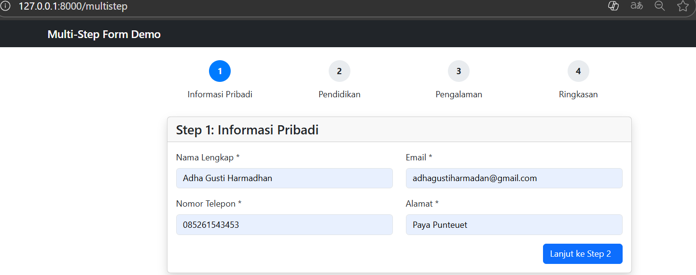
- Submit Step 1 valid → redirect ke Step 2.  
  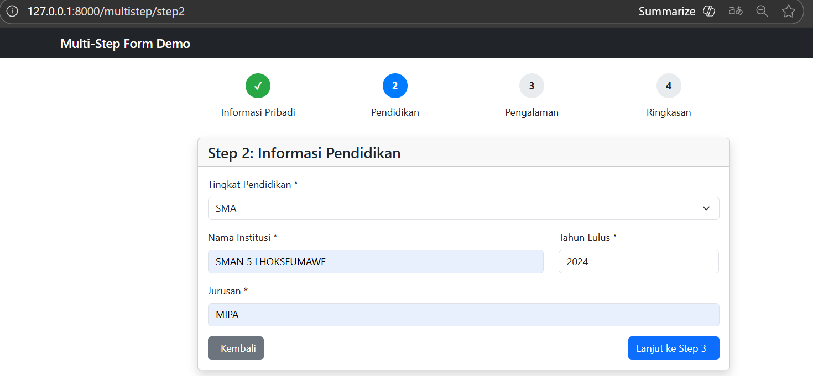
- Step 2: isi data pendidikan → valid → redirect Step 3.  
  
- Summary → menampilkan gabungan data dari session (step1 + step2 + step3).  
  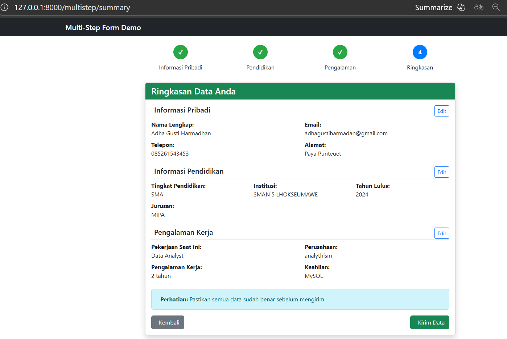
- Complete → menyimpan (atau mensimulasikan penyimpanan) dan menampilkan halaman sukses.  
  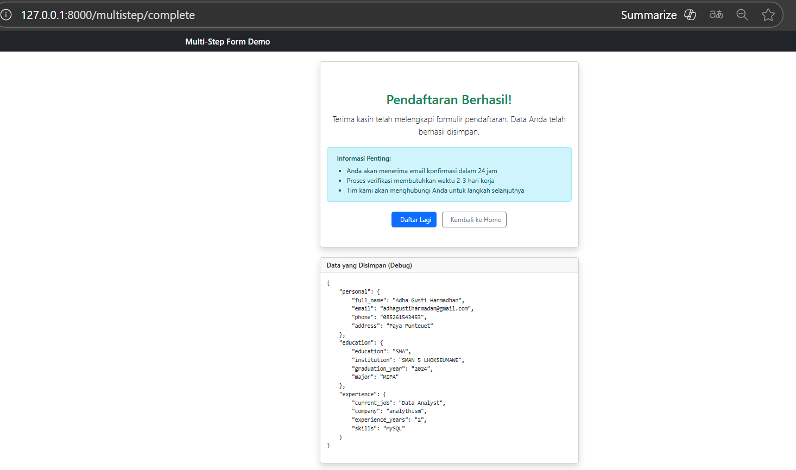

---

## **3. Hasil dan Pembahasan**

Praktikum menunjukkan beberapa poin penting:

- Laravel menyediakan alur lengkap: tampilkan form → terima request → validasi → redirect → tampilkan hasil atau error.
- `@csrf` melindungi form dari CSRF; tanpa token akan terjadi error 419.
- Validasi bawaan cepat dan aman; pesan error kustom membuat UX lebih ramah.
- `old('field')` + error bag membantu user memperbaiki input tanpa mengulang pengetikan.
- Multi-step form dengan session memungkinkan pemecahan form panjang menjadi langkah-langkah yang lebih kecil, serta mencegah pengguna meloncat ke step berikut tanpa menyelesaikan step sebelumnya.

---

## **4. Kesimpulan**

1. Laravel memudahkan pembuatan form yang aman dan tervalidasi dengan sedikit kode.  
2. Pesan error kustom meningkatkan kejelasan bagi pengguna.  
3. Session efektif untuk menyimpan data sementara pada multi-step form.  
4. Dengan menguasai form submission & validation, mahasiswa siap melanjutkan ke topik CRUD dan penyimpanan data ke database.

---

## **5. Referensi**

- Modul 5 - Form Submission & Data Validation — HackMD: https://hackmd.io/@mohdrzu/HJWzYp7Reg
- Dokumentasi Resmi Laravel 12 — Validation & CSRF Protection: https://laravel.com/docs/12.x/validation  

---