# Laporan Modul 6: Model dan Laravel Eloquent

**Mata Kuliah:** Workshop Web Lanjut  
**Nama:** Adha Gusti Harmadhan  
**NIM:** 2024573010009  
**Kelas:** 2B TI

---

## Abstrak

Laporan ini menjelaskan hasil praktikum pada Modul 6: _Model dan Laravel Eloquent_ dalam mata kuliah Workshop Web Lanjut. Fokus praktikum adalah memahami bagaimana Laravel memetakan data ke dalam model, bagaimana Eloquent ORM bekerja untuk operasi CRUD, serta bagaimana pola-pola pendukung seperti DTO dan Repository dapat dipakai untuk merapikan kode. Praktikum dibagi menjadi tiga: (1) binding form ke model sederhana tanpa database, (2) penggunaan Data Transfer Object (DTO) dan service layer, dan (3) membangun aplikasi Todo CRUD menggunakan Eloquent dan MySQL. Melalui percobaan ini mahasiswa diharapkan mampu menghubungkan teori MVC dengan implementasi Laravel yang riil, khususnya pada sisi _Model_ dan interaksinya dengan database.

---

## 1. Dasar Teori

### 1.1 Model dalam Laravel

Dalam arsitektur MVC, **Model** adalah bagian yang mewakili data dan aturan bisnis. Di Laravel, model biasanya berada di folder `app/Models` dan secara default akan terhubung ke tabel yang namanya jamak dari nama model — misalnya model `Product` ke tabel `products`. Model inilah yang berkomunikasi dengan database menggunakan **Eloquent ORM** sehingga kita tidak perlu menulis query SQL mentah setiap kali ingin mengambil atau menyimpan data.

### 1.2 Eloquent ORM

**Eloquent** adalah ORM bawaan Laravel yang menyediakan cara berinteraksi dengan database secara _object-oriented_. Setiap baris pada tabel direpresentasikan sebagai objek model. Operasi umum seperti `all()`, `find()`, `create()`, `update()`, dan `delete()` sudah disediakan sehingga kode jadi lebih singkat dan mudah dibaca.
Contoh model sederhana:

```php
namespace App\Models;

use Illuminate\Database\Eloquent\Model;

class Product extends Model
{
    protected $fillable = ['name', 'price', 'stock'];
}
```

Properti `$fillable` digunakan agar field tersebut boleh di-_mass assign_ saat pemanggilan `Product::create([...])`.

### 1.3 POCO / ViewModel

Sebelum masuk ke database, kadang kita hanya butuh “wadah data” dari form. Pada praktikum pertama, kita memakai kelas PHP biasa (gaya **POCO / ViewModel**) untuk menampung data produk tanpa menyimpannya ke database. Ini berguna kalau kita ingin latihan alur request → controller → view tapi database belum disiapkan.

### 1.4 Data Transfer Object (DTO)

**DTO** dipakai untuk memindahkan data dari lapisan request ke lapisan service atau ke controller lain dalam bentuk yang sudah rapi. Keuntungan memakai DTO:

- data yang masuk lebih terkontrol,
- memisahkan data mentah dari logika bisnis,
- kode controller jadi lebih pendek.

### 1.5 Repository Pattern (sekilas)

Repository dipakai untuk mengabstraksi akses data. Di Laravel, ini cocok kalau nanti aplikasi mulai besar dan kita ingin ganti sumber data (MySQL → API, dsb.) tanpa mengubah controller.

### 1.6 Migrasi, Seeder, dan Eloquent

Untuk praktikum Todo, kita sudah mulai pakai fitur database Laravel:

- **Migration** → membuat struktur tabel dengan kode
- **Seeder** → mengisi data awal
- **Model Eloquent** → mengakses tabel memakai class
- **Controller** → memanggil model dan melempar ke view

Dengan cara ini, alur _Model layer_ Laravel bisa dilihat utuh dari atas ke bawah.

---

## 2. Langkah-Langkah Praktikum

### 2.1 Praktikum 1 — Binding Form ke Model Sederhana (tanpa DB)

**Tujuan praktik (implisit):** latihan mengikat data form ke objek model sederhana agar alur request → controller → view dipahami dulu sebelum pakai Eloquent.

**Langkah-langkah:**

1. Buat proyek baru:  
   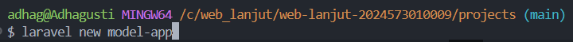

2. Buat ViewModel: `app/ViewModels/ProductViewModel.php` (kode di laporan utama).  
   

3. Buat `ProductController`
   

   dan tambah method `create` & `result`.  
   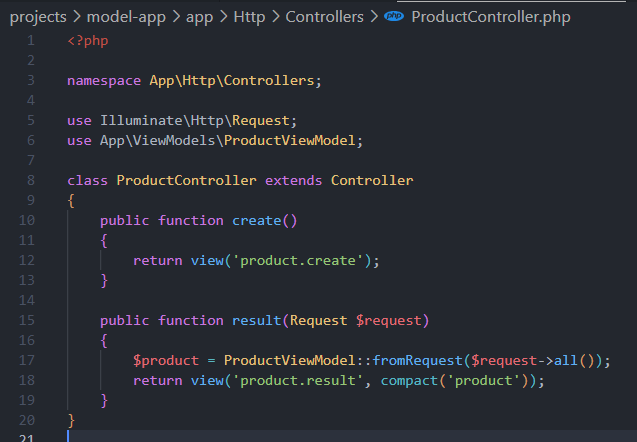

4. Daftarkan route di `routes/web.php` untuk form & result.  
   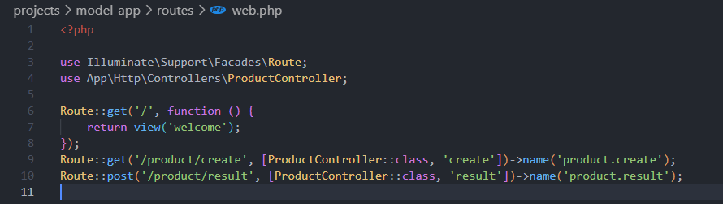

5. Buat view form `resources/views/product/create.blade.php`.  
   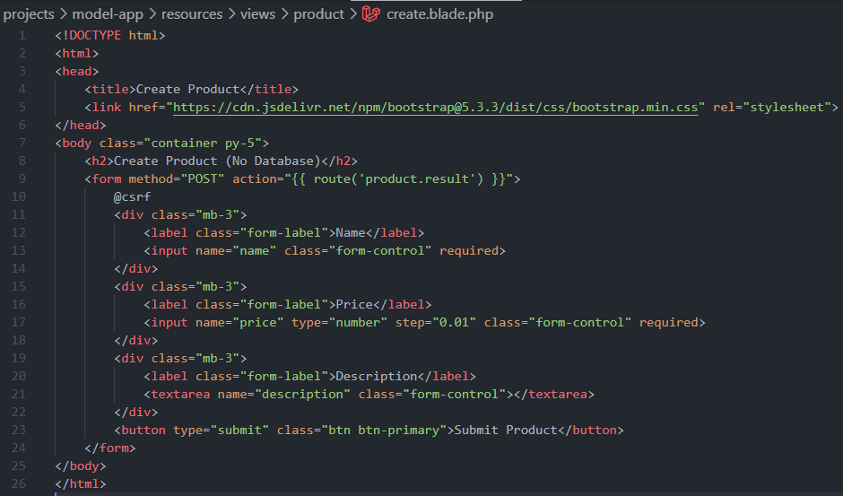

6. Buat view hasil `resources/views/product/result.blade.php`.  
   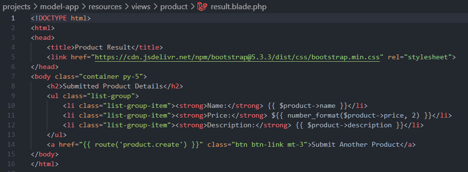

**Hasil Pengujian:**

- `/product/create` → menampilkan form input produk.  
  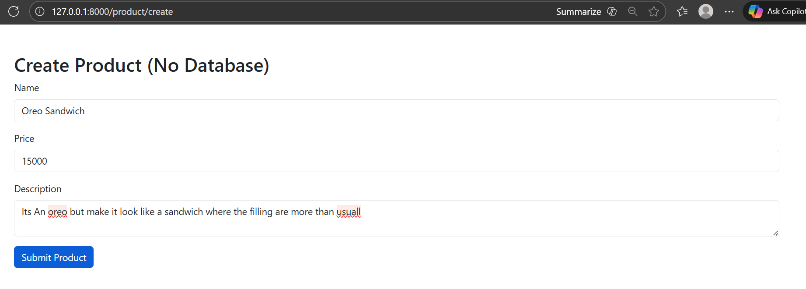
- Submit → `/product/result` menampilkan data yang dikirim (tanpa penyimpanan DB).  
  

### 2.2 Praktikum 2 — Menggunakan DTO dan Service

Pada praktik kedua, alurnya mirip praktikum 1, tetapi datanya tidak langsung dipakai oleh view. Data yang dikirim form dimasukkan dulu ke **DTO**, lalu diproses oleh **service** supaya controller tetap tipis.

**Langkah-langkah:**

1. Buat proyek baru :  
   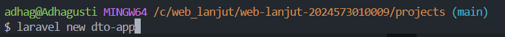

2. Buat DTO: `app/DTO/ProductDTO.php`.
   
3. Buat service: `app/Services/ProductService.php`.  
   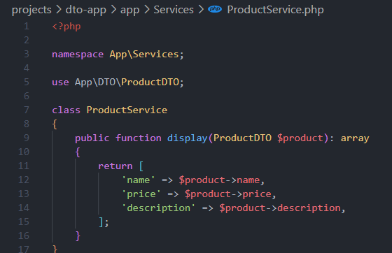
4. Buat `ProductController` Update controller untuk menggunakan DTO dan Service.  
   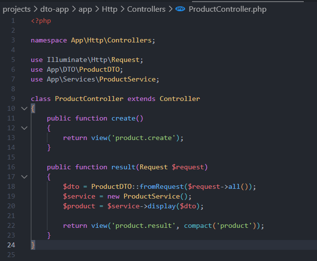

5. Route dan view dapat tetap seperti praktikum 1, hanya hasil yang diolah oleh service.  
   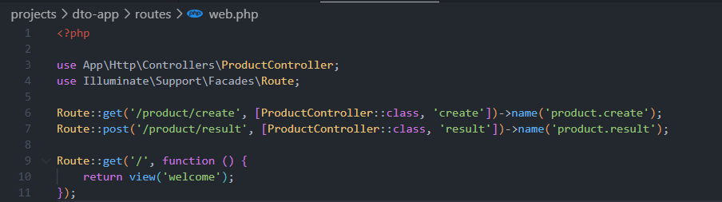
   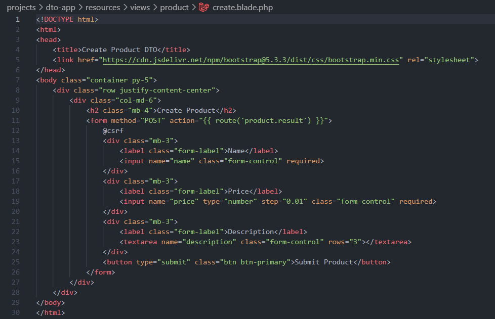
   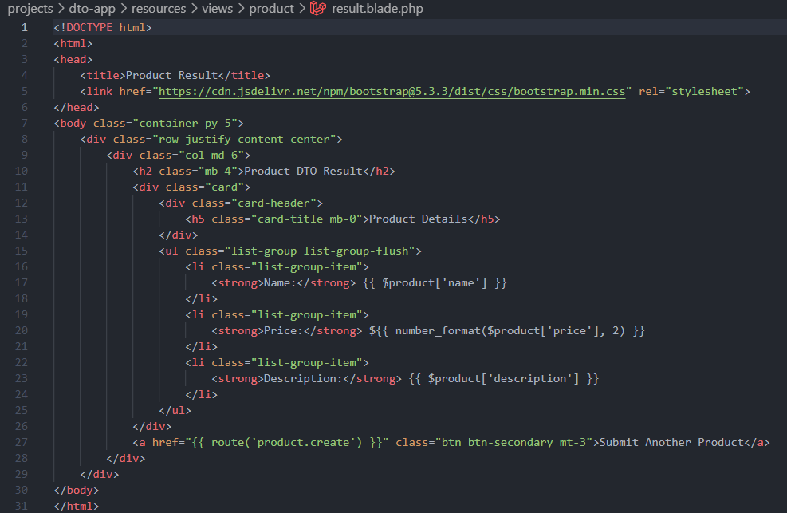

**Hasil Pengujian:**

- `/product/create` → form sama.  
  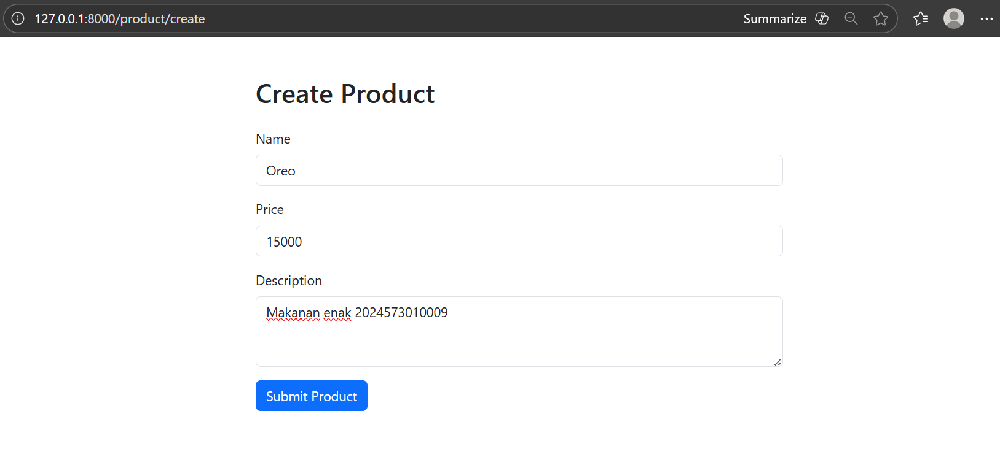
- Submit → hasil ditampilkan menggunakan data dari `ProductService`.  
  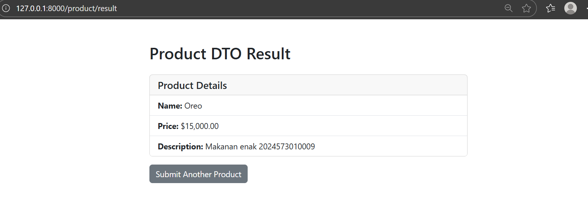

---

### 2.3 Praktikum 3 — Todo CRUD dengan Eloquent dan MySQL

Bagian ini sudah mulai memakai **model Eloquent** plus **migration + seeder**.

**Langkah-langkah utama:**

1. Buat project baru :  
   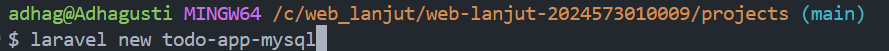

   kemudian Install dependency MySQL:
   ```bash 
   composer require doctrine/dbal
   ```
   Tak lupa juga membuat database tododb

2. Atur database di `.env`.  
   

3. Buat migration `create_todos_table` 
   ```bash
   php artisan make:migration create_todos_table
   ```
   Lalu isi file yang dihasilkan di database/migrations/YYYY_MM_DD_create_todos_table.php dan perbarui
   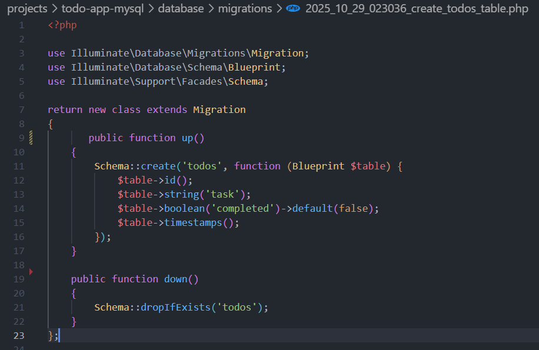

   lalu jalankan 
   ```bash
   php artisan migrate
   ```
4. Buat seeder `TodoSeeder` Jalankan perintah ini untuk membuat seeder: 
   ```bash
   php artisan make:seeder TodoSeeder
   ```
   Buka file yang dihasilkan di database/seeders/TodoSeeder.php dan perbarui:
   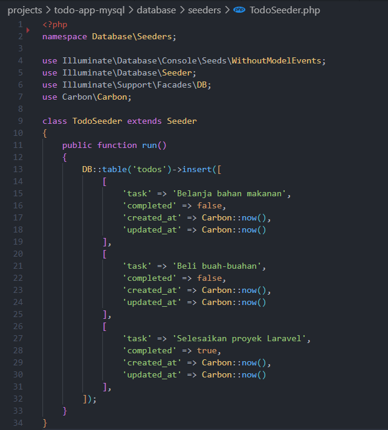

   Lalu jalankan seeder  
   ```bash
   php artisan db:seed --class=TodoSeeder
   ```

5. Buat model `Todo` 
   ```bash
   php artisan make:model Todo
   ```
   Buka file yang dihasilkan di app/Models/Todo.php dan perbarui:
   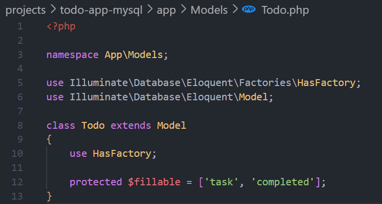

6. Buat `TodoController`     
   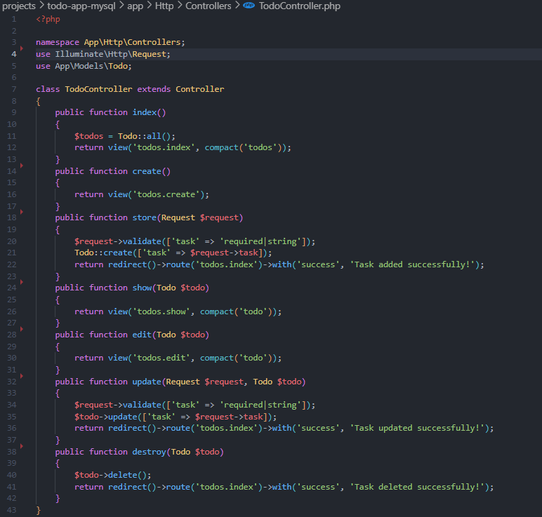

   Dan tambhakan controller tersebut ke route
   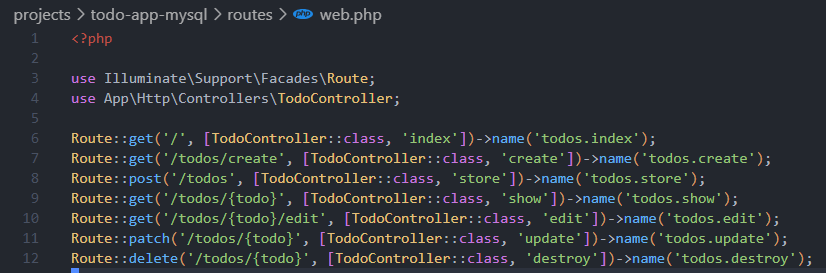

7. Buat Layout lewat file `app.blade.php` di folder layout
   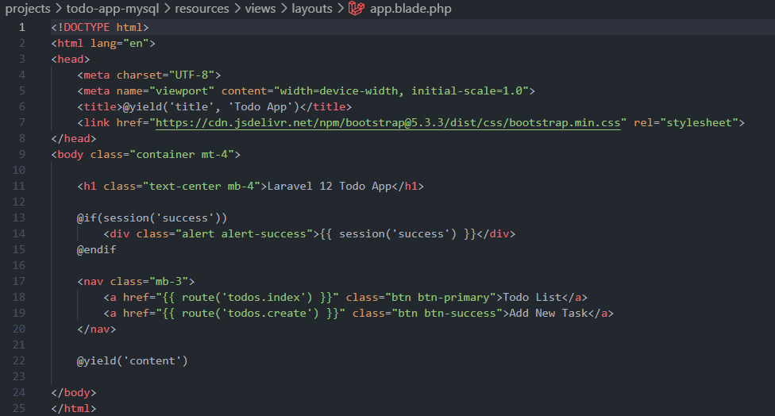

   Kemudian buat view di `resources/views/todos/*` (index, create, edit, show).  
   
   index
   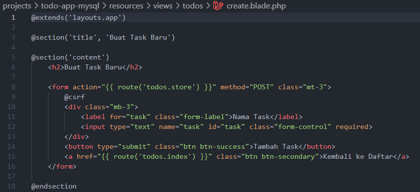

   create
   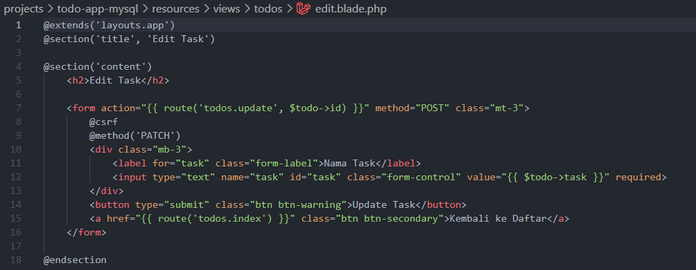

   edit
   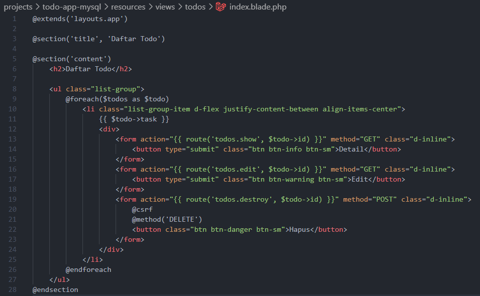

   show
   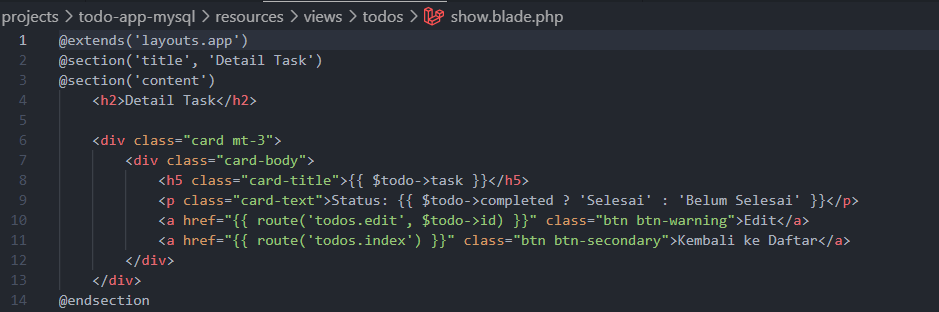

**Hasil Pengujian:**

- `/` → menampilkan daftar todo dari database.  
  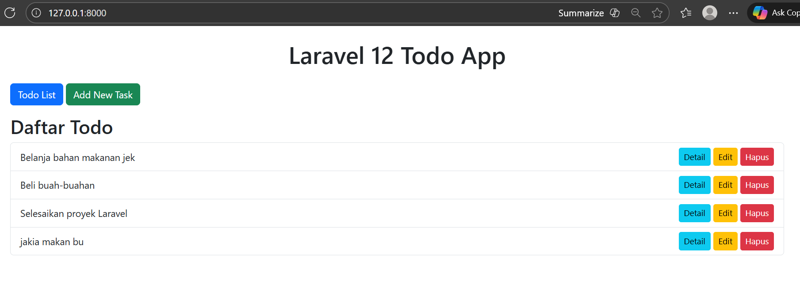
- `/todos/create` → form tambah task, submit menyimpan ke DB.  
  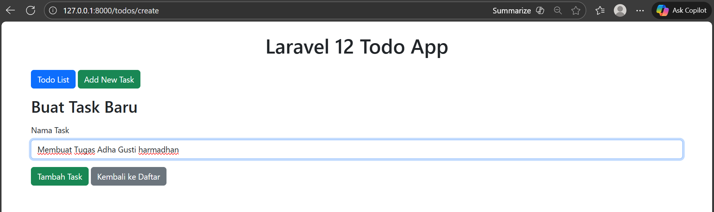
- Edit / Delete bekerja sesuai ekspektasi.  
  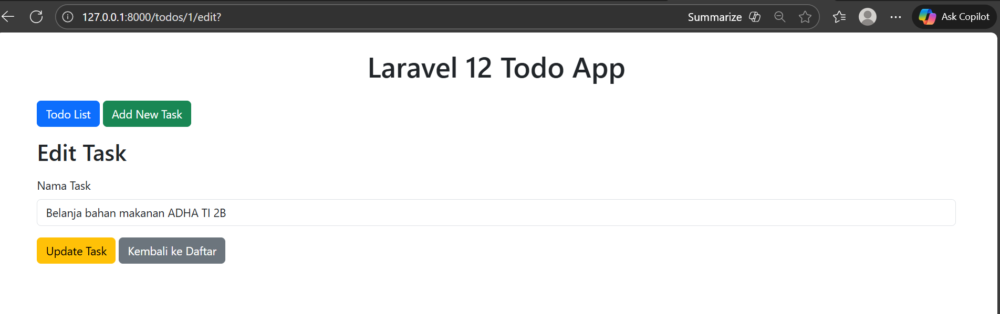

## 3. Hasil dan Pembahasan

1. **Praktikum 1 (tanpa database)** memperkenalkan konsep model sebagai _data holder_ sederhana. `ProductViewModel` membantu memahami bahwa model tidak selalu harus terhubung ke tabel database — fungsinya bisa sekadar menampung data yang dikirim dari form.

2. **Praktikum 2 (DTO dan Service)** memperlihatkan penerapan pola _clean architecture_ di Laravel. Dengan memisahkan data ke `ProductDTO` dan logika ke `ProductService`, controller jadi lebih ringkas, mudah diuji, dan mudah dikembangkan jika nanti logikanya bertambah.

3. **Praktikum 3 (CRUD Eloquent dan MySQL)** adalah penerapan konsep _Model_ yang sesungguhnya di Laravel. Semua operasi database seperti tambah, ubah, hapus, dan tampil dilakukan lewat Eloquent ORM, tanpa perlu menulis query SQL secara manual.

4. Secara keseluruhan, dari ketiga praktikum ini mahasiswa dapat melihat transisi yang jelas dari model sederhana tanpa database, ke model dengan arsitektur DTO–Service, hingga ke model penuh dengan Eloquent ORM yang terhubung langsung ke database MySQL. Hal ini memperkuat pemahaman konsep MVC Laravel dari sisi Model secara menyeluruh.

---

## 4. Kesimpulan

Dari praktikum Modul 6 ini dapat disimpulkan bahwa:

1. **Model di Laravel tidak selalu berarti Eloquent** — kita bisa mulai dari kelas PHP biasa (ViewModel/POCO) untuk menampung data form.
2. **DTO membantu merapikan alur data** dari request ke lapisan lain sehingga controller lebih bersih dan mudah diuji.
3. **Eloquent ORM mempermudah CRUD** karena kita cukup memanggil method bawaan tanpa menulis SQL manual.
4. **Migration dan seeder** membuat struktur database dan data awal bisa dikelola lewat kode dan mudah diulang di lingkungan lain.
5. Dengan menggabungkan controller, route, view, dan model, mahasiswa jadi melihat alur penuh MVC Laravel dari form sampai tersimpan ke database.

---

## 5. Referensi

- Modul 6 - Model dan Laravel Eloquent — (https://hackmd.io/@mohdrzu/ryIIM1a0ll)
- Dokumentasi Resmi Laravel 12 — (https://laravel.com/docs/12.x/eloquent)


