# Laporan Modul 8: Authentication & Authorization

**Mata Kuliah:** Workshop Web Lanjut  
**Nama:** Adha Gusti Harmadhan  
**NIM:** 2024573010009  
**Kelas:** 2B TI

---

## Abstrak

Laporan ini menjelaskan hasil praktikum pada Modul 8: _Authentication & Authorization_ dalam mata kuliah Workshop Web Lanjut. Fokus praktikum adalah memahami mekanisme autentikasi (verifikasi identitas pengguna) dan otorisasi (kontrol akses berdasarkan peran/izin) di Laravel 12. Praktikum terbagi menjadi dua bagian: (1) implementasi autentikasi menggunakan Laravel Breeze (registrasi, login, logout, reset password, profil) dan (2) implementasi kontrol akses berbasis peran (RBAC) sederhana dengan middleware kustom yang membatasi akses ke view berdasarkan peran (admin, manager, user). Dengan praktikum ini mahasiswa diharapkan mampu menerapkan sistem keamanan dasar pada aplikasi Laravel, termasuk enkripsi password, proteksi rute menggunakan middleware, serta pembuatan middleware kustom dan seeder peran.

---

## 1. Dasar Teori

### 1.1 Autentikasi vs Otorisasi

- **Autentikasi (Authentication)**: proses memverifikasi identitas pengguna — contoh: login menggunakan email dan password.  
- **Otorisasi (Authorization)**: proses menentukan tindakan apa yang boleh dilakukan oleh pengguna yang sudah terautentikasi — contoh: hanya admin yang dapat mengakses panel admin.

Keduanya saling melengkapi: autentikasi memastikan siapa pengguna, sedangkan otorisasi menentukan hak aksesnya.

### 1.2 Laravel Breeze (Scaffolding Auth)

Laravel Breeze adalah starter kit minimal untuk fitur autentikasi di Laravel. Breeze menyediakan rute, controller, view (Blade atau Inertia), dan utilitas lain untuk registrasi, login, logout, verifikasi email (opsional), dan reset password. Breeze cocok dipakai sebagai dasar implementasi sistem autentikasi yang simpel dan mudah dikustomisasi.

Instalasi singkat:

```bash
composer require laravel/breeze --dev
php artisan breeze:install
npm install 
php artisan migrate
```

### 1.3 Middleware, Guards, dan Session

- **Middleware** seperti `auth` dapat melindungi rute dan memastikan hanya pengguna terautentikasi yang mengaksesnya.  
- **Guards** menentukan mekanisme autentikasi (mis. session, token).  
- Saat login, Laravel menyimpan status sesi (session) di cookie yang aman; middleware `auth` memeriksa session ini untuk mengizinkan/menolak akses.


## 2. Langkah-Langkah Praktikum

### 2.1 Praktikum 1 — Autentikasi dan Otorisasi dengan Laravel 12 Breeze

**Tujuan praktik (implisit):**  
Mengimplementasikan sistem autentikasi dasar menggunakan Laravel Breeze (registrasi, login, logout, reset password) dan membuat rute yang dilindungi untuk menampilkan profil pengguna.

---

**Langkah-langkah:**

1. Buat proyek Laravel baru:

   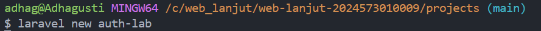

2. Pastikan ekstensi MySQL aktif pada `php.ini` lalu buat database `authlab_db` di MySQL:

   ```sql
   CREATE DATABASE authlab_db;
   ```

   Konfigurasikan `.env`:

    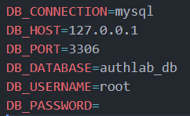

   Clear config cache:

   ```bash
   php artisan config:clear
   ```

3. Instal Laravel Breeze:

   ```bash
   composer require laravel/breeze --dev
   ```
  
   ```bash
   php artisan breeze:install
   ```
    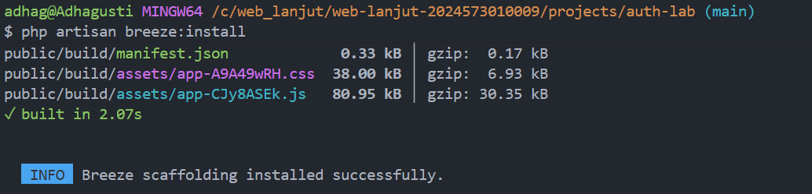

   ```bash
   npm install
   ```
    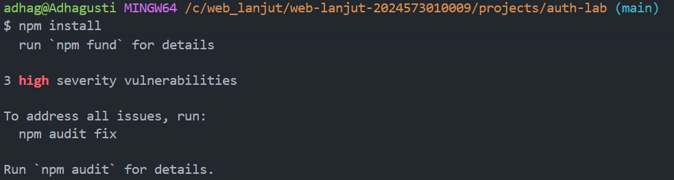
   
   ```bash
   php artisan migrate
   ```
    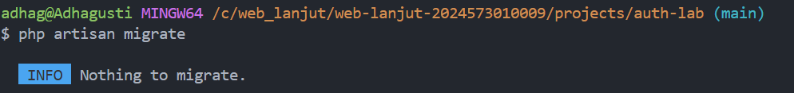
    
4. Jalankan server development:

   ```bash
   php artisan serve
   ```
   Akses http://localhost:8000 → register dan login menggunakan form yang disediakan oleh Breeze.  
   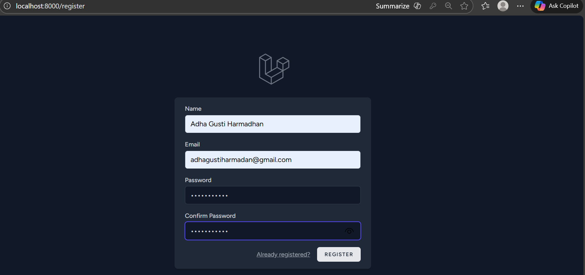

5. Tambahkan rute profil yang dilindungi di `routes/web.php`:

   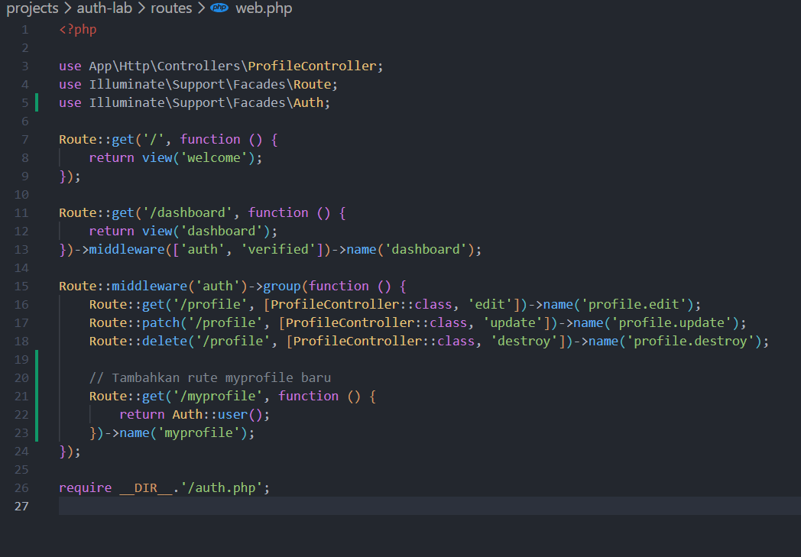

6. Testing rute `/myprofile`:

   - Login terlebih dahulu.  
   - Kunjungi http://localhost:8000/myprofile  
   - Verifikasi JSON user menampilkan `id`, `name`, `email`, `email_verified_at`, `created_at`, `updated_at`.  
   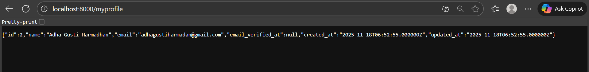

---

**Hasil Pengujian:**

- `http://localhost:8000`Pengguna dapat mendaftar (register), login, logout, dan reset password lewat tampilan Breeze.  
  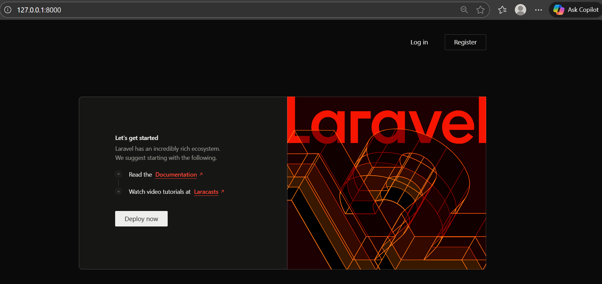

- Rute `/myprofile` hanya bisa diakses oleh pengguna yang sudah login dan menampilkan informasi user.  
  

---

### 2.2 Praktikum 2 — Membatasi Akses Berdasarkan Peran (RBAC) di Laravel 12

**Tujuan praktik (implisit):**  
Mengimplementasikan kontrol akses berbasis peran sederhana (admin, manager, user) menggunakan field `role` di tabel `users`, middleware kustom `RoleMiddleware`, dan view terproteksi per peran.

---

**Langkah-langkah:**

1. Buat proyek Laravel baru:

   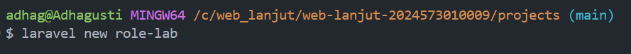

2. Buat database `authrole_db` dan konfigurasi `.env`:

   ```sql
   CREATE DATABASE authrole_db;
   ```

  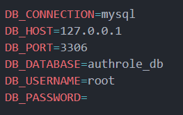

   Clear config:

   ```bash
   php artisan config:clear
   ```
   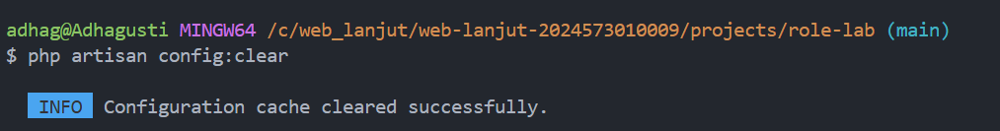

3. Instal Laravel Breeze (opsional untuk auth scaffolding):

   ```bash
   composer require laravel/breeze --dev
   ```
   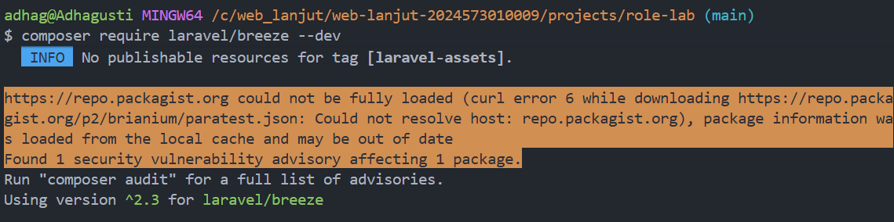
  
   ```bash
   php artisan breeze:install
   ```
    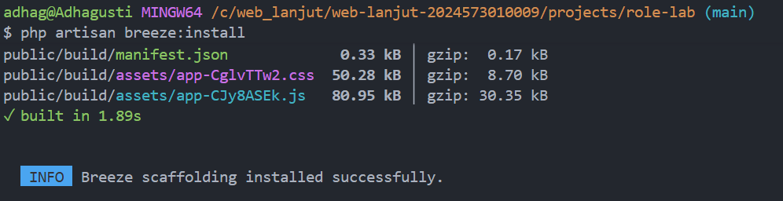 

   ```bash
   npm install
   ```
     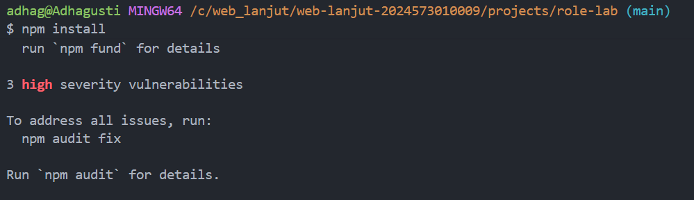
   
   ```bash
   php artisan migrate
   ```
     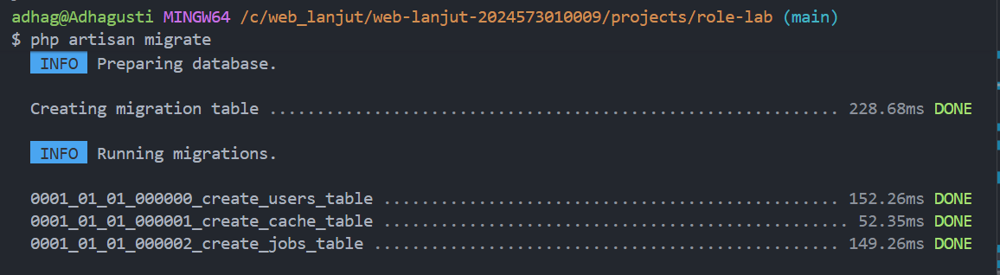

4. Tambahkan field `role` pada tabel `users`:

   Buat migration:

   ```bash
   php artisan make:migration add_role_to_users_table --table=users
   ```
    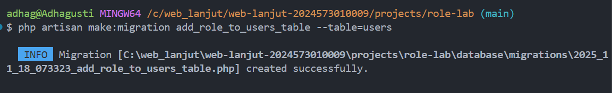

   Edit migration:

    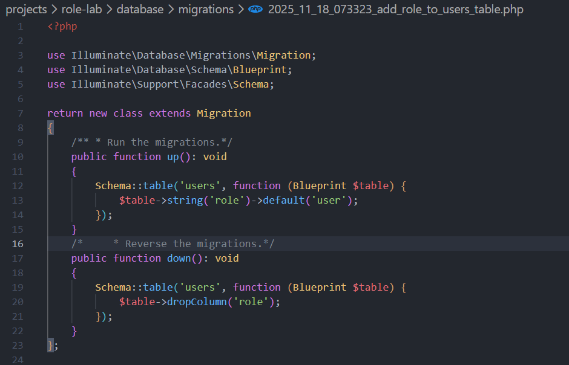


   Jalankan migration:

   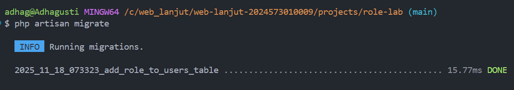

5. Seed pengguna dengan role berbeda (DatabaseSeeder):

   Jalankan seeder:

    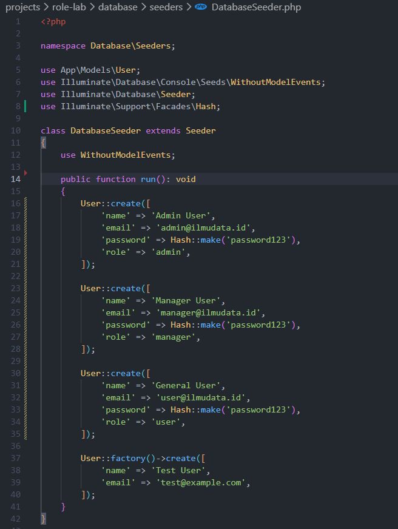

   ```bash
   php artisan db:seed
   ```
   

6. Buat middleware `RoleMiddleware`:

   ```bash
   php artisan make:middleware RoleMiddleware
   ```
    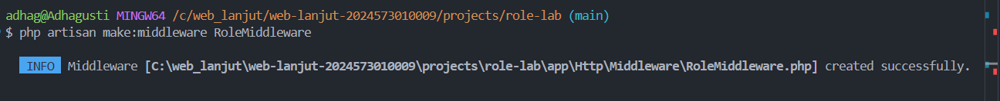

   Edit `app/Http/Middleware/RoleMiddleware.php`:

    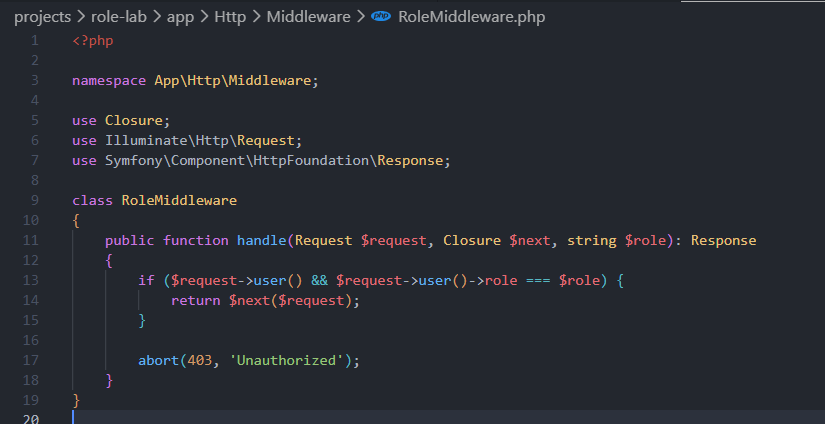

7. Daftarkan alias middleware `role` (contoh setup di `App\\Http\\Kernel.php` atau sesuai struktur proyek):

    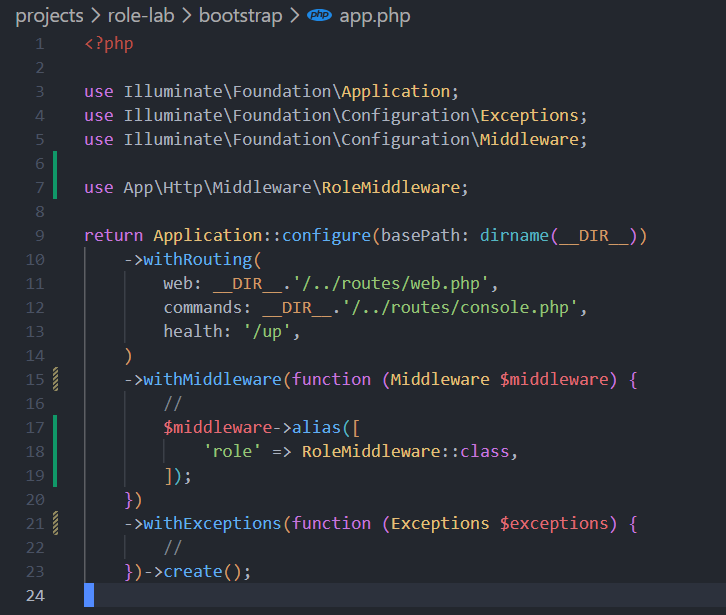

8. Buat view untuk tiap role di `resources/views`:

   - `admin.blade.php`  

      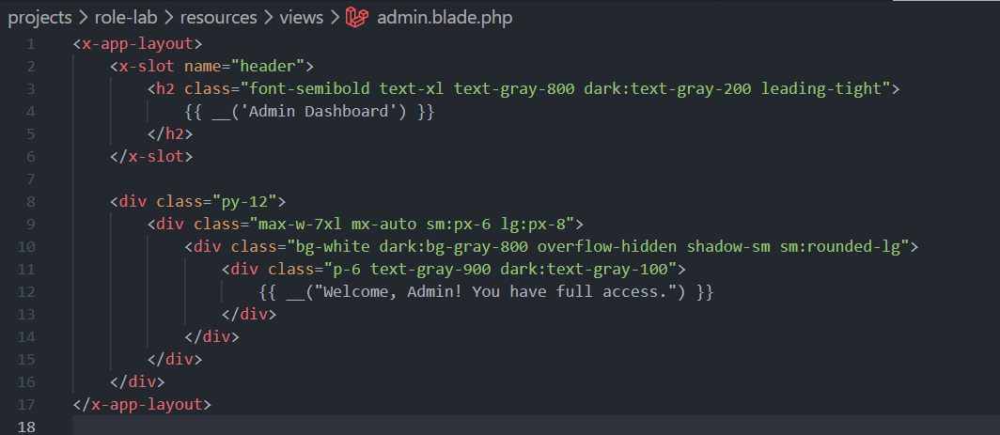

   - `manager.blade.php` 

      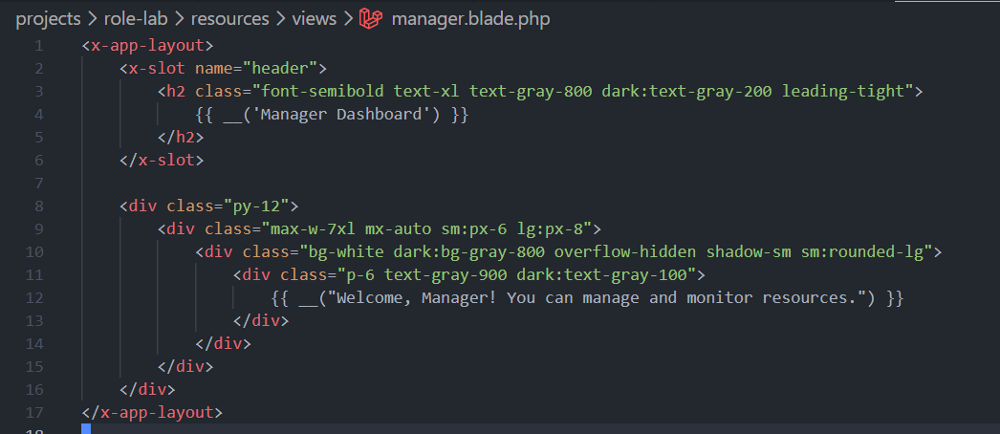

   - `user.blade.php`  
 
      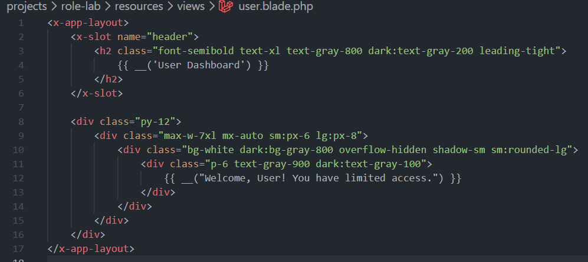

   - `all.blade.php`
      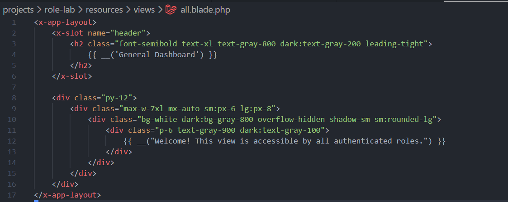
  
9. Definisikan rute berbasis peran di `routes/web.php`:

   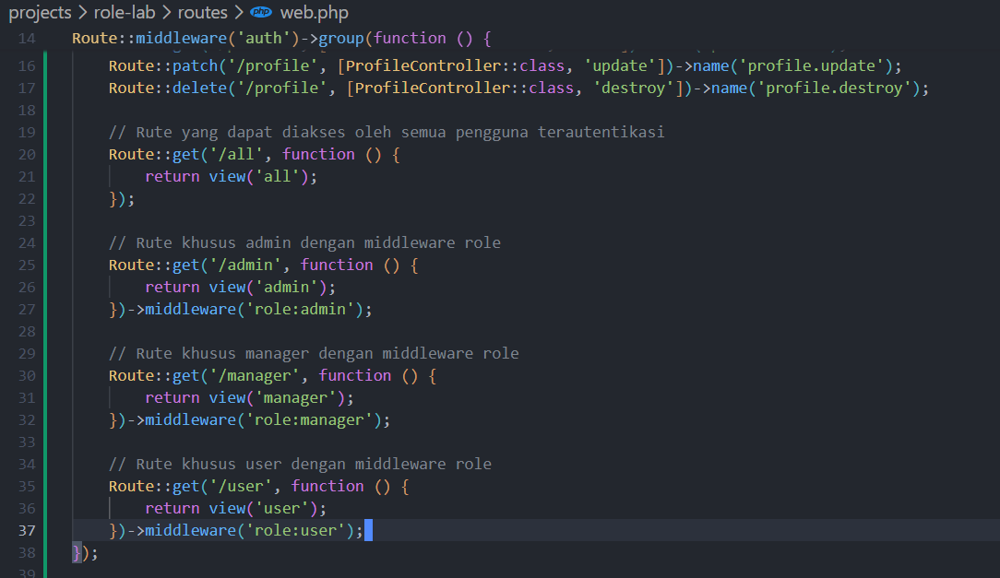

10. Jalankan server dan uji akses:

    ```bash
    php artisan serve
    ```

    - Login dengan akun yang telah di-seed.  
      - Admin: admin@ilmudata.id / password123  
      - Manager: manager@ilmudata.id / password123  
      - User: user@ilmudata.id / password123

    - Akses:
      - `/admin` → hanya admin yang bisa masuk  
      - `/manager` → hanya manager yang bisa masuk  
      - `/user` → hanya user yang bisa masuk  
      - `/all` → semua pengguna terautentikasi bisa mengakses  

---

**Hasil Pengujian:**

- `http://127.0.0.1:8000/admin` → berhasil diakses oleh role admin, menampilkan halaman khusus admin.  
  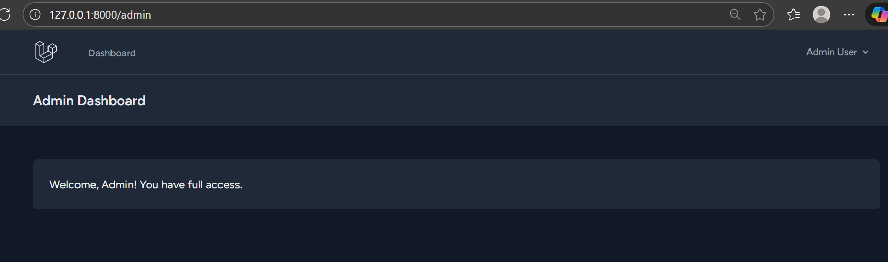

- `http://127.0.0.1:8000/manager` → berhasil diakses oleh role manager, menampilkan halaman khusus manager.  
  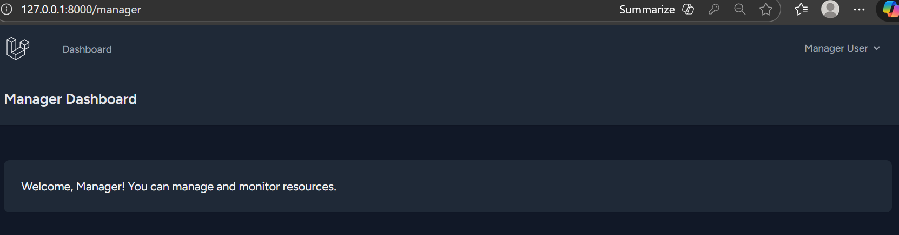

- `http://127.0.0.1:8000/user` → berhasil diakses oleh role user, menampilkan halaman khusus user.  
  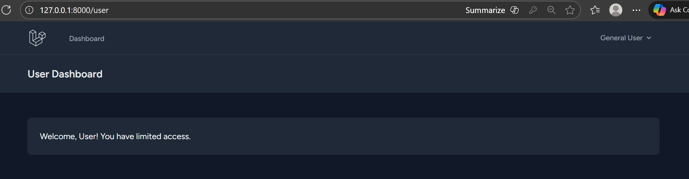

- `http://127.0.0.1:8000/all` → berhasil diakses oleh semua role (admin, manager, user).  
  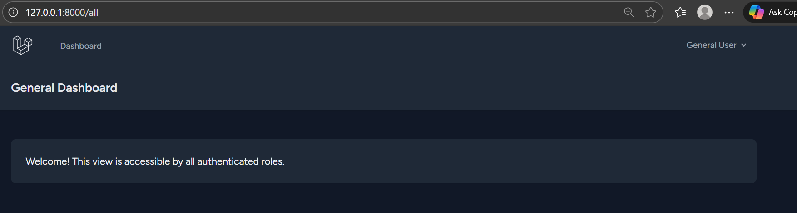

- Jika pengguna dengan role tidak sesuai mencoba membuka salah satu halaman di atas, sistem menampilkan  HTTP 403 Forbidden 
   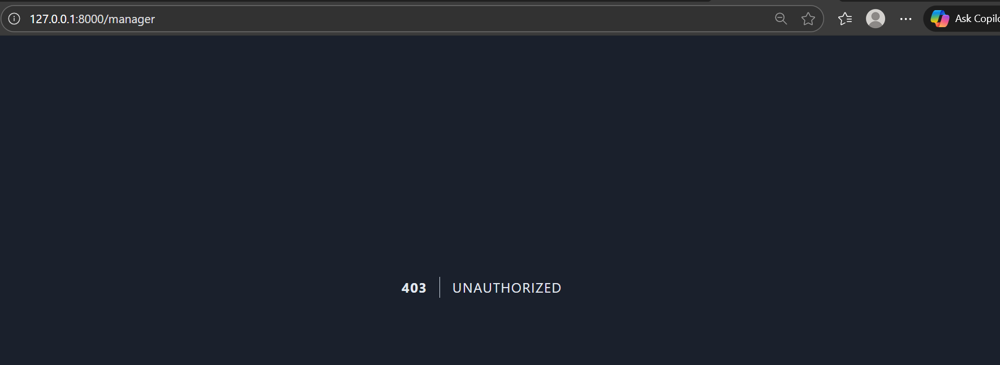
---

## 3. Hasil dan Pembahasan

1. **Autentikasi (Breeze)**: Laravel Breeze menyediakan scaffolding autentikasi lengkap dan siap pakai sehingga implementasi registrasi, login, logout, dan reset password dapat dilakukan dengan cepat. Enkripsi password dilakukan otomatis menggunakan bcrypt saat menyimpan user.

2. **Rute Terproteksi**: Middleware `auth` efektif dalam membatasi akses rute hanya kepada pengguna yang sudah login. Rute `/myprofile` adalah contoh sederhana untuk memverifikasi status autentikasi dan menampilkan data user.

3. **RBAC Sederhana**: Menambahkan kolom `role` ke tabel `users` dan membuat middleware `RoleMiddleware` memungkinkan penerapan pembatasan akses berbasis peran tanpa paket tambahan. Pendekatan ini cocok untuk kebutuhan sederhana.

4. **Kelemahan Pendekatan Sederhana**: Mengelola role sebagai string di kolom `role` memadai untuk skenario kecil, tetapi untuk aplikasi lebih besar sebaiknya menggunakan pendekatan yang lebih fleksibel seperti tabel roles & permissions (mis. paket Spatie) untuk granularitas dan kemudahan manajemen.

5. **Keamanan**: Pastikan selalu memvalidasi dan men-escape input, gunakan CSRF protection (sudah otomatis pada group `web`), dan gunakan HTTPS pada deployment produksi untuk menjaga keamanan sesi.

---

## 4. Kesimpulan

Dari praktikum Modul 8 ini dapat disimpulkan bahwa:

1. Laravel menyediakan alat yang lengkap untuk autentikasi (Breeze) dan otorisasi (Gates, Policies, middleware). Breeze mempercepat pembuatan fitur auth dasar, sedangkan middleware/policy/gate digunakan untuk otorisasi.  
2. Middleware `auth` dan middleware kustom (`RoleMiddleware`) dapat digunakan untuk menerapkan proteksi rute dan kontrol akses berbasis peran.  
3. Untuk kebutuhan skala kecil, menambah kolom `role` pada tabel `users` sudah cukup; untuk kebutuhan yang lebih kompleks, paket seperti Spatie Laravel Permission lebih direkomendasikan.  
4. Praktikum ini memberikan pemahaman praktis tentang bagaimana mengamankan aplikasi Laravel dari sisi autentikasi dan otorisasi, serta fondasi untuk membangun sistem RBAC yang lebih matang.

---

## 5. Referensi

- Modul 8 - Authentication & Authorization — ((https://hackmd.io/@mohdrzu/BypBawklWg))  
- Dokumentasi Laravel Breeze — (https://laravel.com/docs/12.x/starter-kits#laravel-breeze)  
